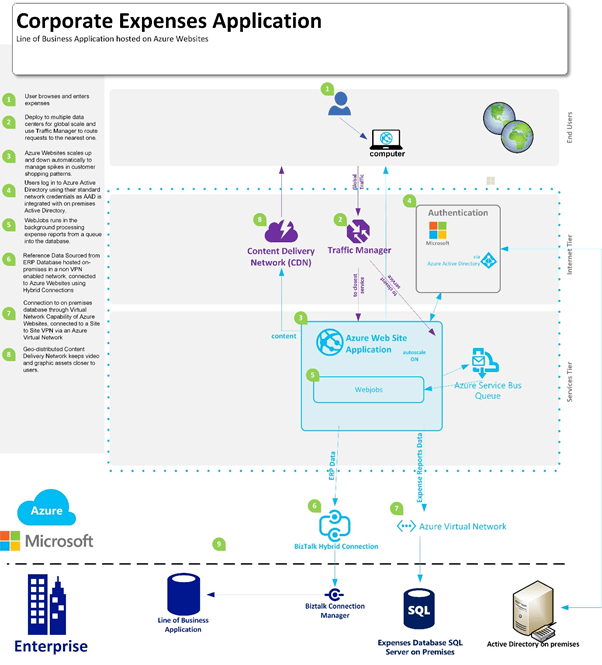

<properties 
	pageTitle="面向企业的 Azure 网站 Web Apps 产品" 
	description="演示如何使用 Azure 网站 Web Apps 为您的企业创建企业网站解决方案" 
	services="app-service\web" 
	documentationCenter="" 
	authors="apwestgarth" 
	manager="wpickett" 
	editor=""/>

<tags 
	ms.service="app-service-web"  
	ms.date="08/04/2015" 
	wacn.date="10/03/2015"/>

# 适用于企业的 Azure 网站产品白皮书 #

降低成本以及在快速发展的环境中更快地交付 IT 解决方案的要求为开发人员、IT 专业人员和管理人员带来了新的挑战。用户日益期望其业务线 (LOB) Web 应用程序能够在任何设备上快速运行和响应。同时，企业正在尝试利用由于与云和移动服务集成所带来的生产力和效率提高，这简单可到使用 Active Directory 实现的跨设备的单一登录，复杂可到使用从内部 LOB 应用程序（反过来也可以从公司 Salesforce 实施中拉取数据）中提取的数据在 Office365 中进行协作。Azure 网站 Web Apps 是一种用于开发、测试和运行 Web 及移动应用程序、Web API 和一般网站的企业级云服务。它可以用于在针对扩展和可用性优化的全球数据中心网络上运行企业网站、业务应用程序和数字营销活动，同时还支持持续集成和现代 DevOps 实践。

本白皮书重点介绍专门侧重于运行 LOB Web 应用程序的 Web Apps 功能，涵盖现有 Web 应用程序的迁移和平台上全新 LOB Web 应用程序的部署。

## 目标受众 ##

希望迁移至当前在本地运行的云 Web 工作负荷的 IT 专业人员、架构师和管理人员。Web 工作负荷能够跨越业务到员工，或者跨越业务到合作伙伴的 web 应用程序。

## 介绍 ##

Azure 网站是一款理想的平台，可用于托管外部和内部 Web 应用程序和服务，因为它提供了一款经济高效、高度可扩展、托管的解决方案，使您能够集中精力为用户创造商业价值，而不用耗费大量时间和资金维护和支持单独的环境。Web Apps 提供了一款灵活的平台，可用于部署企业 Web 应用程序，从而提供能够通过与 Windows Azure Active Directory 集成继续按照本地 Active Directory 进行身份验证的能力；支持利用内部连续集成和部署实践轻松、快速地进行部署，同时自动进行扩展来满足业务需求 - 所有这些都在一个托管平台上实现，使您能够专注于您的应用程序，而不是您的基础架构。

## 问题定义 ##

IT 环境正在快速变化，从在资本成本高、前置时间长的传统服务器上进行托管迁移到使用能够自动扩展以处理负载的按需式服务的托管。IT 部门不得不降低基础架构的成本和占地空间以及维护支出以减少资本支出，同时也在不断增加灵活性。较旧的基础架构平台（例如 Windows Server 2003）生命周期的结束正促使 IT 部门将云迁移作为一种避免新的长期资本成本的潜在方法。在过去，首席信息官为其他部门制定购买决策；但是慢慢地首席营销官和其他业务部门的负责人在如何花费其预算以及其投资有哪些回报方面发挥着更加积极的作用。企业日益需要其员工比以前任何时候都更具移动性，让员工能够远程工作，花费更多时间与客户在一起，满足客户轻松访问系统的需求。

企业需要每天、每周、每月都进行变革。企业正在借助由第三方或内部提供的充满新特性的定期更新服务寻求即时全球扩展。用户的期望更高，许多人是在自己的私人生活中利用这些服务（例如 Office365）。他们希望在其工作生活中有权访问类似的、最新的、功能丰富的服务。为了满足这种需求，IT 部门必须致力于通过选择和集成第三方服务，仔细选择可以适应业务需求的平台，同时可靠地降低总体拥有成本，帮助企业满足这种需求。

开发团队正在寻求提供即时业务利益，频繁地推出新功能。它们正在寻找一种集成其现有工具和实践（开发、测试、发布）的经济高效、可靠的平台；而且正在与 IT 部门合作实现部署、管理和告警的自动化，以期实现零停机的目标。

## 高级别的解决方案 ##

Web 平台和框架越来越多地被用于开发、测试和托管业务线应用程序。就典型的业务线应用程序而言（例如内部员工支出系统），通常仅包含一个带有用于存储与应用程序相关数据的支持数据库的 Web 应用。

Azure 网站是托管此类应用程序一个不错的选择，提供可扩展且可靠的基础架构，后者的管理和修补具有接近零的人工干预和停机时间。Windows Azure 平台提供了许多数据存储选项来支持在 Web Apps 上托管的 Web 应用程序，从托管的可扩展关系型数据库即服务 Windows Azure SQL 数据库，到我们的 ClearDB MySQL 数据库和 MongoDB 等合作伙伴提供的热门服务。

下图是一个具有适用于本地资源的连接选项的高级解决方案示例。

## 商业效益 ##

Azure 网站提供大量商业效益，能够让您的功能更加经济高效，并灵活地进行交付来满足业务需求。

### PaaS 模型 ###

Azure 网站构建于一种平台即服务的模型之上，可提供成本的大幅节省和效率的显著提高。你不再需要花费数小时管理虚拟机以及修补操作系统和框架。Web Apps 是一个自动修补的环境，使您可以集中精力管理 Web 应用程序而不用管理虚拟机，从而让团队有更多时间创造更多业务价值。

支撑 Web Apps 的 PaaS 模型支持 DevOps 方法的执行者实现其目标。作为一项业务，这意味着在应用程序整个生命周期（包括开发、测试、发布、监控与管理和支持）中完整的管理和集成。

对于开发团队而言，可以通过 Visual Studio Online、 GitHub、TeamCity、Hudson 或 BitBucket 配置连续的集成和开发工作流，从而自动地进行构建、测试和部署，加快发布周期，同时减少在现有基础架构中发布所涉及的摩擦。Web Apps 还支持为您的发布工作流创建多个测试和过渡环境，因此您不再需要为上述目的保留或分配硬件，您可以根据需要创建环境并定义自己发布工作流的升级。作为一项业务，您可以决定从源代码管理中发布到测试槽，执行一系列测试，成功完成后升级到过渡槽，最后在不停机的情况下切换到生产环境，其附加价值是：在 Web Apps 上托管的 Web 应用程序为预加载，并且能够及时提供最佳客户体验。

借助内置的监控和警报功能，运营团队可以确信它们处于最佳位置，能够对在 Web Apps 上托管的 Web 应用程序的任何问题作出快速反应。如果运营团队已投资来自 Microsoft Visual Studio Application Insights、New Relic 和 AppDynamics 的分析和监控解决方案，Web Apps 上也完全支持这些解决方案，从而实现了连续性，并支持通过熟悉的环境来监控 Web 应用程序。

最后，Web Apps 提供自动将您的应用和托管数据库直接备份到 Azure Blob 存储容器的功能。为你提供了一种简单和经济高效的方法从灾难中恢复，从而降低了对复杂的本地硬件和软件的要求。

### 易迁移性 ###

随着硬件和操作系统的发布周期加速，硬件维护和循环成为企业的一个关键问题。你可能有大量即将在 2015 年支持服务到期的 Windows Server 2003 R2 服务器，但它们仍然托管着企业的关键 web 应用程序？ Azure 网站是托管这些 Web 应用程序和帮助您合理利用企业硬件资产的理想之选。Web Apps 允许您访问作为服务一部分管理和维护的各种硬件规格，从而无需考虑增加基础架构预算的替换和管理成本。迁移可以很简单，只需将来自您现有部署的操作复制和粘贴到 Web Apps，或者更复杂一些的迁移，使用 Web Apps 迁移助手将增加价值。已迁移的 web 应用程序可享受全套 Azure 服务 — 将附加服务集成到 web 应用程序。例如，你可以考虑添加 Azure Active Directory，以基于用户与安全组的关联控制对应用程序的访问。另一个示例是可以添加缓存服务来提高性能和减少延迟，从而提供更佳的整体用户体验。

### 企业类托管 ###

Azure 网站提供了一个稳定、可靠的平台，后者已被证实能够满足从小型内部开发和测试工作负荷到高度可扩展的高流量网站的各种业务需求。通过使用 Web Apps，您可以使用与 Microsoft 公司用于处理高价值 Web 工作负荷相同的企业类托管平台。Web Apps 以及 Azure 平台上的所有服务均符合安全要求和遵从法规要求，如 ISO (ISO/IEC 27001:2005）；SOC1 和 SOC2 SSAE 16/ISAE 3402 Attestations、HIPAA BAA、PCI 和 Fedramp，是每个元素和功能的核心，有关详细信息，请参阅[http://aka.ms/azurecompliance](/support/trust-center/compliance/)。

Windows Azure 平台支持基于角色的身份验证控制，从而支持企业控制级别到 Web Apps 内的资源。RBAC 支持企业在 Azure 环境中为其所有资产实施自己的访问管理策略，将用户分配到组并反过来根据 Web 应用等资产将所需的权限分配给这些组。关于 Azure 中 RBAC 的详细信息，请参阅 [http://aka.ms/azurerbac](/documentation/articles/role-based-access-control-configure)。通过利用 Web Apps，您可以确保您的 Web 应用程序部署在安全可靠的环境中，并且您对资产部署到哪些区域拥有完全控制权。

### 全球扩展 ###

Azure 网站是一个全球和可扩展的平台，使您的 Web 应用程序能够增长并快速适应不断成长的企业的需求，只需要最少的长期规划和最低的成本。在典型的本地基础架构场景中，本地和地理上需求的扩展和增长都需要大量的管理、规划和支出以供应和管理额外的基础架构。Web Apps 支持根据需求的变化扩展您的 Web 应用程序。例如，下面我们使用开支应用程序作为例子，在一个月的大部分时间内，您的用户很少会使用该应用程序，但是随着每个月支出提交截止日期的邻近，应用程序的使用会增加，Web Apps 能够自动为您的应用程序供应更多基础架构，一旦应用程序的使用再次减少，它能够缩放回您所定义的基线基础架构。

借助 Web Apps，您的企业能够轻松实现全球覆盖和扩展。随着您的公司发展到新区域，您在 Web Apps 上使用和托管的报表应用程序仪表板可以被轻松地部署到其他数据中心，并通过 Web Apps 和 Azure Traffic Manager 组合更快地服务本地用户，其附加效益在于底层的可扩展基础架构能够随着区域办事处需求的变化而缩小和扩展。
 
## 解决方案详细信息 ##

让我们看一个应用程序迁移方案的示例。这概述了 Azure 网站功能如何共同来提供出色解决方案和业务价值的详细信息。
 
在整个示例中，我们要讨论的业务线应用程序是一个支出报表应用程序，它使员工能够提交费用进行报销。该应用程序托管于运行 IIS6 的 Windows Server 2003 R2 上，数据库是 SQL Server 2005 数据库。我们选择较旧服务器的原因在于 Windows Server 2003 R2 和 SQL Server 2005 的服务即将到期，并且我们拥有自动将工作负荷迁移到 Azure 的[工具](http://aka.ms/websitesmigration)和[指南](http://aka.ms/websitesmigrationresources)。基于这一点，此示例中所使用的模式将适用于各种迁移场景。

### 迁移现有应用程序 ###

将业务线应用程序迁移到 Web Apps 的总体解决方案中的第一步是确定现有应用程序资产和体系结构。本白皮书中的示例是托管在单个 IIS 服务器上的 ASP.NET web 应用程序，以及托管在单独的 SQL Server 上的数据库（如图中所示）。员工使用用户名和密码组合登录到系统，输入支出的详细信息并将每项开支收据的扫描副本上传到数据库。
 

#### 需要注意的事项 ####

当迁移应用程序来自本地环境时，您可能需要记住 Web Apps 的几个限制。以下是将 Web 应用程序迁移到 Web Apps 时需要注意的一些关键主题 ([http://aka.ms/websitesmigrationresources](http://aka.ms/websitesmigrationresources))：

-	端口绑定 - Web Apps 仅支持用于 HTTP 的端口 80 和用于 HTTPS 通信的端口 443。如果您的应用程序使用任何其他端口，则一次迁移的应用程序将使用用于 HTTP 的端口 80 和用于 HTTPS 通信的端口 443。这通常是一个无害的问题，因为在本地部署中使用不同的端口以克服域名的使用是很常见的情况，尤其是在开发和测试环境中
-	身份验证 – 默认情况下 Web Apps 支持匿名身份验证，而且还支持由应用程序鉴定的表单身份验证。当应用程序仅与 Azure Active Directory 和 ADFS 集成时，Web Apps 可以提供 Windows 身份验证。此功能在[此处](/documentation/articles/web-sites-business-application-solution-overview/)有更详细的讨论 
-	基于 GAC 的程序集 – Web Apps 不允许将程序集部署到全局程序集缓存 (GAC) 中。因此，如果迁移的应用程序在本地利用此功能，请考虑将这些程序集移到该应用程序的 bin 文件夹。
-	IIS5 兼容模式 – Web Apps 不支持 IIS5 兼容模式，因此每个 Web Apps 实例和父 Web Apps 实例下的所有 Web 应用程序均在单个应用程序池内相同的工作进程中运行。
-	使用 COM 库 – Web Apps 不允许 COM 组件在平台上注册。因此如果该应用程序正在使用 COM 组件，就需要将这些在托管代码中进行重写并使用该应用程序进行部署。
-	ISAPI 筛选器 – Web Apps 可支持 ISAPI 筛选器。需要将它们部署为应用程序的一部分，并在 Web 应用程序的 web.config 文件中进行注册。有关详细信息，请参阅 [http://aka.ms/azurewebsitesxdt](/documentation/articles/web-sites-transform-extend)。 

考虑完这些主题之后，您的 Web 应用程序已准备好支持云。如果一些主题没有完全被满足也不用担心，迁移工具将为迁移提供最佳支持。

迁移流程中的后续步骤是创建 Azure 网站和 Azure SQL 数据库。有多个具有不同 CPU 内核数量和 RAM 数量的各种规模的 Web Apps 实例可供您根据 Web 应用程序需求选择。有关详细信息和定价，请参阅 [http://aka.ms/azurewebsitesskus](/home/features/web-site/#price)。同样，Windows Azure SQL 数据库适用于所有业务需求，可提供各种服务层和性能级别来满足需求。更多信息可访问 [http://aka.ms/azuresqldbskus](/pricing/details/sql-database/)。创建完成后，应用程序被上传到 Azure 网站（通过 FTP 或 WebDeploy），然后再迁移到数据库。

在创建 Azure SQL 数据库时，可使用多种方法从本地服务器中导入现有数据库，从生成现有数据库的脚本到使用[数据层应用程序导出和导入](/documentation/articles/sql-database-cloud-migrate/)。

创建一个新的 Azure SQL 数据库，使用 SQL Server Management Studio 连接到数据库，然后运行脚本构建数据库架构并用来自本地数据库的数据对其进行填充，此时开支应用程序数据库创建完成。

迁移第一阶段中的最后一步需要将连接字符串更新到应用程序的数据库。这可以通过 Azure 门户来完成。对于每个 Web 应用，您可以修改应用程序的特定设置，包括被应用程序用来连接正在使用的任何数据库的任意连接字符串。

### 使用 Azure SQL 数据库的替代方法 ###

Azure 平台提供了一些替代方法，可以将 Azure SQL 数据库用作 Web 应用程序的主数据库，从而使不同的工作负荷（例如，使用 NoSQL 解决方案）或使该平台可以满足业务的数据需要。例如，业务可能会保存不得存储在场外或公用云环境中的数据，因此会通过查找来维护对其本地数据库的使用。

#### 扩展性和弹性 ####

随着企业的成长，其员工数量也会增长（通过收购或自然的有机增长），因此也必须对 web 应用程序进行扩展以满足这些新需求。事实上，现在经常可以看到同地协同团队和远程办公员工的快速扩展，例如在美国、欧洲和亚洲设有办事处的公司，以及在很多地区组建移动销售团队的公司。Web Apps 能够方便、自动处理弹性缩放比例的更改。

Azure 网站允许通过 Azure 门户将 Web 应用程序配置为可自动进行缩放，具体取决于两个矢量 – 计划时间或按 CPU 使用率。Web Apps 自动缩放提供了一种经济高效而又极其灵活的方式来满足所有业务应用程序（从诸如我们的支出报表系统之类的 Web 应用程序到市场营销网站）在使用上不断变化的要求，而这会在短时升级过程中带来流量的显著提高。有关使用 Web Apps 扩展 Web 应用程序的详细信息和指南，请参阅[如何扩展网站](/documentation/articles/web-sites-scale)。

除了 Web Apps 的缩放灵活性之外，整个平台可以跨多个数据中心和地理区域根据 Web 应用程序及其资产的可能分布启用业务连续性和复原功能。

## 摘要 ##
Azure 网站提供了一款灵活、经济高效、响应迅速的解决方案在快速发展的环境中满足企业不断变化的需求。Web Apps 帮助企业利用托管平台以及现代化的 DevOps 功能和减少的人工管理提高了生产力和效率，同时提供企业扩展功能、弹性、安全性以及与本地资产的集成。

## 行动号召 ##
有关 Azure 网站服务的详细信息，请访问 [http://aka.ms/enterprisewebsites](/documentation/services/web-sites/)，在这里您可以查看更多信息；并登录 [http://aka.ms/azuretrial](/pricing/1rmb-trial) 立即注册试用版，评估该服务并发现为您企业带来的优势。

 
 

<!---HONumber=71-->