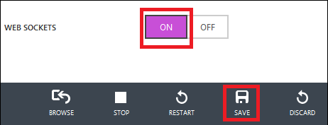

<properties linkid="dev-nodejs- Website-with-socketio" urlDisplayName=" Website Using Socket.IO" pageTitle="使用 Socket.io 构建 Node.js 网站 - Azure 教程" metaKeywords="Azure Node.js socket.io tutorial, Azure Node.js socket.io, Azure Node.js tutorial" description="本教程将演示如何在托管在 Azure 上的 node.js 网站中使用 socket.io。" metaCanonical="" services="web-sites" documentationCenter="Node.js" title="Build a Node.js Chat Application with Socket.IO on an Azure Website" authors="larryfr" solutions="" videoId="" scriptId="" manager="paulettm" editor="mollybos" />

<tags ms.serive="website" ms.date="03/24/2015" wacn.date="04/11/2015"/>

# 在 Azure 网站中使用 Socket.IO 构建 Node.js 聊天应用程序

Socket.IO 使用 WebSocket 在 node.js 服务器和客户端之间提供实时通信。还支持回退到使用低版本浏览器的其他传输（如长轮询）。本教程将指导您将基于 Socket.IO 的聊天应用程序作为 Azure 网站托管。有关 Socket.IO 的详细信息，请参阅 [http://socket.io/][socketio]。

> [AZURE.NOTE] 在本任务中的过程适用于 Azure 网站；关于云服务，请参阅 <a href="/documentation/articles/cloud-services-nodejs-chat-app-socketio/">在 Azure 云服务中使用 Socket.IO 生成 Node.js 聊天应用程序</a>。

## 下载聊天示例

对于此项目，我们将使用[Socket.IO
GitHub 存储库]中的聊天示例。若要下载该示例，请执行以下步骤，
并将其添加到之前创建的项目。

1.  下载 Socket.IO 项目的[ZIP 或 GZ 存档版本][版本] （版本 1.0.6 已用于本文档）

3.  提取存档并将**examples\\chat**
    目录复制到新位置。例如，
    **\\node\\chat**。

## 修改 App.js 并安装模块

在应用程序部署到 Azure 之前，我们必须
进行一些小改动。

1.  将**index.js**文件重命名为**app.js**。这可支持 Azure 检测它是否为 Node.js 应用程序。

1.  在记事本或其他文本编辑器中打开**app.js**文件。

2.  在 app.js 的开头处查找**模块依赖项**，并将包含`var io = require('../..')(server)；`的行更改为`var io = require('socket.io')(server)；`如下所示：

		var express = require('express');
		var app = express();
		var server = require('http').createServer(app);
		// var io = require('../..')(server);
		var io = require('socket.io')(server);
		var port = process.env.PORT || 3000;

在保存对 app.js 的更改后，使用以下步骤
安装所需模块：

1.  在命令行中，将目录更改为**\\node\\chat**目录，然后使用以下命令安装此应用程序所需的模块：

        npm install

    这将安装 package.json 文件中所列的模块。命令
    完成之后，你应该会看到与下面
    类似的输出：

	    express@3.4.8 node_modules\express
		+-- methods@0.1.0
		+-- merge-descriptors@0.0.1
		+-- debug@0.8.1
		+-- cookie-signature@1.0.1
		+-- range-parser@0.0.4
		+-- fresh@0.2.0
		+-- buffer-crc32@0.2.1
		+-- cookie@0.1.0
		+-- mkdirp@0.3.5
		+-- commander@1.3.2 (keypress@0.1.0)
		+-- send@0.1.4 (mime@1.2.11)
		+-- connect@2.12.0 (uid2@0.0.3, pause@0.0.1, qs@0.6.6, bytes@0.2.1, raw-body@1.1.2, batch@0.5.0, negotiator@0.3.0, multiparty@2.2.0)

2.  由于此示例最初是 Socket.IO GitHub 存储库的一部分，
    并通过相关路径直接引用了 Socket.IO 库，
    package.json 文件未引用 Socket.IO，
    因此我们必须通过发出以下命令进行安装：

        npm install socket.io@1.0.6 -save

	> [AZURE.NOTE] 尽管 Socket.IO 的最新版本可能适用于本文中的步骤中，版本 1.0.6 已对其进行测试。

## 创建 Azure 网站

按照以下步骤创建 Azure 网站、启用 Git 发布，然后为网站启用 WebSocket 支持。

> [AZURE.NOTE] 要完成本教程，您需要一个 Azure 帐户。如果你没有帐户，只需花费几分钟就能创建一个试用帐户。有关详细信息，请参阅： <a href="/pricing/1rmb-trial/" target="_blank">Azure 试用版</a>。

1. 从命令行，将目录更改为**\\node\chat**目录，然后使用下面的命令创建一个新的 Windows Azure 网站并且为该网站和本地目录启用 Git 存储库。这还将创建一个名为 'azure'的 Git remote。

		azure site create mysitename --git

	您必须将 'mysitename'替换为您的网站的唯一名称。

2. 通过使用以下命令将现有文件提交到本地存储库：

		git add .
		git commit -m "Initial commit"

3. 使用以下命令将这些文件推送到 Azure 网站存储库：

		git push azure master

	在服务器上导入模块时您将收到状态消息。此过程完成后，应用程序将在 Azure 网站上托管。

 	> [AZURE.NOTE] 在模块安装过程中，您可能会发现 'The imported project ... was not found'的错误。这些错误可放心地忽略。

4. Socket.IO 使用的 WebSocket 在 Azure 上默认不启用。若要启用 Web 套接字，请使用以下命令：

		azure site set -w

	如果系统提示，则输入网站的名称。

	>[AZURE.NOTE]
	> 'azure site set -w'命令将仅使用 Windows Azure 的跨平台命令行接口 0.7.4 版或更高版本。您还可以使用 Azure 管理门户启用 WebSocket 支持。
	>
	>若要使用[Azure 管理门户](https://manage.windowsazure.cn)启用 WebSocket，请选择您的网站的"配置"页，对于 Web 套接字条目选择"ON"，然后单击"保存"。
	>
	>

5. 若要查看 Azure 上的网站，请使用以下命令启动您的 Web 浏览器并导航到托管的网站：

		azure site browse

您的应用程序现正在 Azure 上运行，并可以
使用 Socket.IO 在不同客户端之间传递聊天消息。

> [AZURE.NOTE] 为简单起见，此示例仅限于连接到同一实例的用户之间的聊天。这意味着如果云服务创建两个辅助角色实例，用户将只能够与连接到同一辅助角色实例的其他用户聊天。要缩放应用程序以使用多个角色实例，你可以使用像 Service Bus 这样的技术在实例之间共享 Socket.IO 存储状态。有关示例，请参阅 Azure SDK for Node.js GitHub 存储库 <a href="https://github.com/WindowsAzure/azure-sdk-for-node">中的 Service Bus 队列和主题使用情况示例</a>。

<!--
## 向外扩展

Socket.IO 应用程序可通过__适配器__实现横向扩展，以在多个应用程序实例之间发布消息和事件。尽管有几个适配器可用，[socket.io redis](https://github.com/automattic/socket.io-redis)适配器可轻松与 Azure Redis Cache 功能一同使用。

> [AZURE.NOTE] 向外扩展 Socket.IO 解决方案还要求支持粘滞会话。默认情况下，可以通过 Azure 请求路由为 Azure 网站启用粘滞会话。更多详细信息，请参阅[Azure 网站中的实例关联](http://azure.microsoft.com/blog/2013/11/18/disabling-arrs-instance-affinity-in-windows-azure-web-sites/)

### 创建 Redis 缓存

执行[在 Azure Redis Cache 中创建缓存](http://go.microsoft.com/fwlink/p/?linkid=398592&clcid=0x409)中的步骤，以创建新的缓存。

> [AZURE.NOTE] 保存适用于缓存的__主机名称__和__主键__，因为接下来的步骤需要这些信息。

### 添加 redis 和 socket.io redis 模块

1. 从命令行中，更改为__\\node\\chat__目录，并使用以下命令。

		npm install socket.io-redis@0.1.3 redis@0.11.0 --save

	> [AZURE.NOTE] 此命令中指定的版本是测试本文时使用的版本。

2. 修改__app.js__文件以立即在`var io = require('socket.io')(server)；`后添加下列行

		var pub = require('redis').createClient(6379,'redishostname', {auth_pass: 'rediskey', return_buffers: true});
		var sub = require('redis').createClient(6379,'redishostname', {auth_pass: 'rediskey', return_buffers: true});

		var redis = require('socket.io-redis');
		io.adapter(redis({pubClient: pub, subClient: sub}));

用适用于您的 Redis 缓存的主机名称和键替换__redishostname__和__rediskey__。

这将创建到之前创建的 Redis 缓存的发布和订阅客户端。客户端然后与适配器一同使用，以配置 Socket.IO 将 Redis 缓存用于在应用程序的实例之间传递消息和事件

> [AZURE.NOTE] 尽管__socket.io redis__适配器能够与 Redis 直接通信，但（自 2014 年 7 月 14 日起的）当前版本不支持 Azure Redis cache 所需的身份验证。因此需使用__redis__模块创建初始连接，将客户端传递至__socket.io redis__适配器。
>
> 尽管 Azure Redis Cache 支持使用端口 6380 进行安全连接，但此示例中使用的模块不支持自 2014 年 7 月 14 日起的安全连接。上述代码使用默认的 6380 非安全端口。

3. 保存已修改的__app.js__

### 提交更改并重新部署

从__\\node\\chat__目录中的命令行中，使用以下命令提交更改，并重新部署该应用程序。

	git add .
	git commit -m "implementing scale out"
	git push azure master

将所做的更改推送到服务器后，您可以使用以下命令跨多个实例缩放您的网站。

	azure site scale instances --instances #

其中__#__是要创建的实例数。

可以从多个浏览器或计算机连接到您的网站，以验证消息是否已正确发送给所有客户端。
-->

## 故障排除

### 连接限制

Azure 网站提供多个 SKU，这些 SKU 用于确定您的站点可用的资源。包括允许的 WebSocket 连接数。更多详细信息，请参阅[网站定价页][定价]。

### 未使用 WebSocket 发送消息

如果客户端浏览器一直回退到长轮询而不是使用 Websocket，可能有以下几种原因。

- **尝试限制传输到该 Websocket**

为了使 Socket.IO 使用 Websocket 进行消息传输，服务器和客户端必须支持 Websocket。如果其中任一个不支持，则 Socket.IO 将协商其他传输，如长轮询。Socket.IO 使用的默认传输列表为`websocket, htmlfile, xhr-polling, jsonp-polling`。您可以在包含`, nicknames = {};` 的行后面将以下代码添加到**app.js**文件，以强制其仅使用 WebSocket。

		io.configure(function() {
		 	io.set('transports', ['websocket']);
		});

	> [AZURE.NOTE] 注意，上述代码为活动状态时，不支持 Websocket 的低版本浏览器将无法连接到站点，因为此代码将通信限制为仅支持 Websocket 通信。

- **使用 SSL**

Websocket 依赖于某些较少使用的 HTTP 标头，如**升级**标头。某些中间网络设备（例如 Web 代理）可能会删除这些标头。为避免发生此问题，可以建立基于 SSL 的 WebSocket 连接。

完成此操作的简单方法是将 Socket.IO 配置到 `match origin protocol`。这会指示 Socket.IO 保护 Websocket 通信，使之和网页原始 HTTP/HTTPS 请求一样。如果浏览器使用 HTTPS URL 访问您的网站，将基于 SSL 保护通过 Socket.IO 的后续 WebSocket 通信。

要将此示例修改为启用此配置，请在包含`, nicknames = {};`的行后面将下列代码添加到**app.js**文件。

		io.configure(function() {
		  io.set('match origin protocol', true);
		});

- **验证 web.config 设置**

托管 Node.js 应用程序的 Azure 网站使用**web.config**文件，以将传入请求路由到 Node.js 应用程序。为了使 Websocket 对 Node.js 应用程序正常运行，**web.config**必须包含以下条目。

		<webSocket enabled="false"/>

这将禁用 IIS Websocket 模块，其中包括自身的 Websocket 实施以及与 Node.js 特定 WebSocket 模块（如 Socket.IO）的冲突。如果此行不存在，或者设置为 `true`，其原因主要是 WebSocket 传输不适用于您的应用程序。

Node.js 应用程序通常不包括**web.config**文件，因此 Azure 网站将在部署 Node.js 应用程序时自动生成一个。由于此文件是在服务器上自动生成的，因此必须使用网站的 FTP 或 FTPS URL 来查看此文件。您可以通过选择您的网站，然后选择**仪表板**链接，在 Azure 管理门户中查找网站的 FTP 和 FTPS URL。URL 将显示在**速览**部分。

	> [AZURE.NOTE] 如果应用程序未提供**Web.config**文件，则该文件将仅由 Azure 网站生成。如果在应用程序项目的根目录下提供了**web.config**文件，则 Azure 网站将使用该文件。

如果该条目不存在，或者设置为 `true`的值，那么您应在 Node.js 应用程序的根目录中创建**web.config**，并将值指定为 `false`。例如，使用**app.js**作为入口点的应用程序的默认**web.config**，如下所示。

		<?xml version="1.0" encoding="utf-8"?>
		<!--
		     This configuration file is required if iisnode is used to run node processes behind
		     IIS or IIS Express.  For more information, visit:

		     https://github.com/tjanczuk/iisnode/blob/master/src/samples/configuration/web.config
		-->

		<configuration>
		  <system.webServer>
		    <!-- Visit http://blogs.msdn.com/b/windowsazure/archive/2013/11/14/introduction-to-websockets-on-windows-azure-web-sites.aspx for more information on WebSocket support -->
		    <webSocket enabled="false" />
		    <handlers>
		      <!-- Indicates that the server.js file is a node.js site to be handled by the iisnode module -->
		      <add name="iisnode" path="app.js" verb="*" modules="iisnode"/>
		    </handlers>
		    <rewrite>
		      <rules>
		        <!-- Do not interfere with requests for node-inspector debugging -->
		        <rule name="NodeInspector" patternSyntax="ECMAScript" stopProcessing="true">
		          <match url="^app.js\/debug[\/]?" />
		        </rule>

		        <!-- First we consider whether the incoming URL matches a physical file in the /public folder -->
		        <rule name="StaticContent">
		          <action type="Rewrite" url="public{REQUEST_URI}"/>
		        </rule>

		        <!-- All other URLs are mapped to the node.js site entry point -->
		        <rule name="DynamicContent">
		          <conditions>
		            <add input="{REQUEST_FILENAME}" matchType="IsFile" negate="True"/>
		          </conditions>
		          <action type="Rewrite" url="app.js"/>
		        </rule>
		      </rules>
		    </rewrite>
		    <!--
		      You can control how Node is hosted within IIS using the following options:
		        * watchedFiles: semi-colon separated list of files that will be watched for changes to restart the server
		        * node_env: will be propagated to node as NODE_ENV environment variable
		        * debuggingEnabled - controls whether the built-in debugger is enabled

		      See https://github.com/tjanczuk/iisnode/blob/master/src/samples/configuration/web.config for a full list of options
		    -->
		    <!--<iisnode watchedFiles="web.config;*.js"/>-->
		  </system.webServer>
		</configuration>

	> [AZURE.NOTE] 如果您的应用程序使用的入口点不是**app.js**，您必须将出现的所有**app.js**替换为正确的入口点。例如，将**app.js**替换为**server.js**。

## 后续步骤

在本教程中，您将了解如何创建在 Azure 网站中托管的聊天应用程序。您还可以将该应用程序作为 Azure 云服务托管。有关如何完成此过程的步骤，请参阅[在 Windows Azure 云服务][cloudservice]中使用 Socket.IO 构建 Node.js 聊天应用程序。

[socketio]: http://socket.io/
[completed-app]: ./media/web-sites-nodejs-chat-app-socketio/websitesocketcomplete.png
[Socket.IO GitHub 存储库]: https://github.com/Automattic/socket.io
[版本]: https://github.com/Automattic/socket.io/releases
[cloudservice]: /documentation/articles/cloud-services-nodejs-chat-app-socketio/

[chat-example-view]: ./media/web-sites-nodejs-chat-app-socketio/socketio-2.png
[npm-output]: ./media/web-sites-nodejs-chat-app-socketio/socketio-7.png
[定价]: /home/features/web-site/#price
