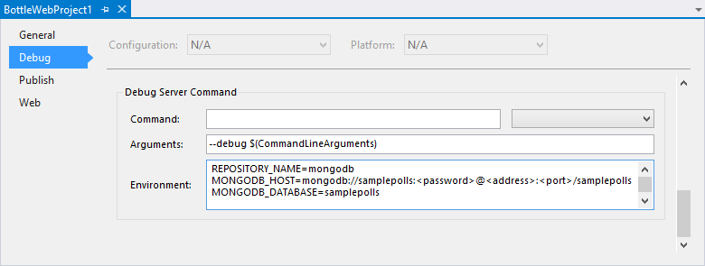

<properties 
	pageTitle="具有 Python Tools 2.1 for Visual Studio 的 Azure 上的 Bottle 和 MongoDB" 
	description="了解如何使用 Python Tools for Visual Studio 来创建 Bottle 应用程序，该应用程序在 MongoDB 数据库实例中存储数据并且可以部署到 Azure App Service Web Apps。" 
	services="app-service\web" 
	documentationCenter="python" 
	authors="huguesv" 
	manager="wpickett" 
	editor=""/>

<tags 
	ms.service="app-service-web"  
	ms.date="04/15/2015" 
	wacn.date="08/29/2015"/>

# 具有 Python Tools 2.1 for Visual Studio 的 Azure 上的 Bottle 和 MongoDB

> **注意：**目前预览门户中不支持 MongoLab 工作流

在本教程中，我们将使用 [Python Tools for Visual Studio] 通过其中一个 PTVS 样本模板创建一个简单的轮询 Web 应用。还以[视频](https://www.youtube.com/watch?v=8hQMyf8p_Jo)形式提供了本教程。

轮询 Web 应用定义其存储库的抽象，因此您可以轻松地在不同类型存储库（内存中、Azure 表存储、MongoDB）之间进行切换。

我们将了解如何使用在 Azure 上托管的 MongoDB 服务之一、如何配置应用程序使用 MongoDB 和如何将 Web 应用发布到 <!--[-->Azure App Service Web Apps<!--](http://go.microsoft.com/fwlink/?LinkId=529714)-->。

请参阅 [Python 开发人员中心]以获取更多文章，这些文章涵盖了通过 PTVS 使用 Bottle、Flask 和 Django web 框架开发 Azure App Service Web Apps，使用 MongoDB、Azure 表存储、MySQL 和 SQL 数据库服务来开发 Azure App Service Web Apps。虽然本文将着重介绍 App Service，但是步骤相似于开发 [Azure 云服务]。

+ [先决条件](#prerequisites)
+ [创建项目](#create-the-project)
+ [创建 MongoDB 数据库](#create-a-mongodb-database)
+ [配置项目](#configure-the-project)
+ [了解 MongoDB 数据库](#explore-the-mongodb-database)
+ [发布到 Azure 网站](#publish-to-an-azure-website)
+ [配置 Azure 网站](#configure-the-azure-website)
+ [后续步骤](#next-steps)

##先决条件

 - Visual Studio 2012 或 2013
 - [Python Tools 2.1 for Visual Studio]
 - [Python Tools 2.1 for Visual Studio 样本 VSIX]
 - [Azure SDK Tools for VS 2013] 或 [Azure SDK Tools for VS 2012]
 - [Python 2.7 32 位]或 [Python 3.4 32 位]
 - [RoboMongo](http://robomongo.org/)(optional)

[AZURE.INCLUDE [create-account-and-websites-note](../includes/create-account-and-websites-note.md)]

<!-->[AZURE.NOTE]如果您想要在注册 Azure 帐户之前开始使用 Azure App Service，请转到[试用 App Service](http://go.microsoft.com/fwlink/?LinkId=523751)，您可以在 App Service 中立即创建一个生存期较短的入门 Web 应用。你不需要使用信用卡，也不需要做出承诺。-->

## 创建项目

在此部分中，我们将使用样本模板创建 Visual Studio 项目。我们将创建虚拟环境并安装所需软件包。然后，我们将使用默认内存中存储库在本地运行应用程序。

1.  在 Visual Studio 中，选择**文件**、**新建项目**。 

1.  在 **Python**、**Samples** 下提供来自 PTVS 样本 VSIX 的项目模板。选择**轮询 Bottle Web 项目**，然后单击“确定”以创建项目。

  	

1.  系统将提示您安装外部软件包。选择**安装到虚拟环境**。

  	

1.  选择 **Python 2.7** 或 **Python 3.4** 作为基础解释程序。

  	

1.  按 <kbd>F5</kbd> 以确认该应用程序有效。默认情况下，该应用程序使用内存中存储库，这并不需要任何配置。停止 web 服务器时，所有数据都会丢失。

1.  单击**创建样本轮询**，然后单击轮询并进行投票。

  	

## 创建 MongoDB 数据库

对于数据库，我们将在 Azure 上创建 MongoLab 托管数据库。

作为替代方法，可以在 Azure 上创建自己的虚拟机，然后亲自安装和管理 MongoDB。

通过执行以下步骤，可以使用 MongoLab 创建免费试用版。

1.  登录到 [Azure 管理门户]。

1.  在导航窗格的底部，单击**新建**。

  	<!--  -->

1.  依次单击**应用商店**、**MongoLab**和**下一步**。

  	<!--  -->

1.  在**名称**中，键入要用于数据库服务的名称。

1.  选择要在其中查找数据库服务的**区域**。如果将从您的 Azure 应用程序使用数据库，请选择要在其中部署您的应用程序的同一区域。

  	<!--  -->

1.  依次单击**下一步**和**采购**。

## 配置项目

在此部分中，我们将配置应用程序以使用我们刚刚创建的 MongoDB 数据库。我们将了解如何从 Azure 门户中获取连接设置。然后我们将在本地运行应用程序。

1.  在 [Azure 管理门户]中，请单击**应用商店**，然后单击先前创建的 MongoLab 服务。

1.  单击**连接信息**。可以使用复制按钮将 **MONGOLAB_URI** 的值置于剪贴板上。

  	<!-- -->

1.  在“解决方案资源管理器”中，右键单击项目，然后选择**属性**。单击**调试**选项卡。

  	

1.  在**调试服务器命令**、**环境**中设置应用程序所需的环境变量的值。

        REPOSITORY_NAME=mongodb
        MONGODB_HOST=<value of MONGOLAB_URI>
        MONGODB_DATABASE=<database name>

    您**启动调试**时，这会设置环境变量。如果您**启动但不调试**希望设置变量，还在**运行服务器命令**下设置相同值。

    或者，可以使用 Windows 控制面板来定义环境变量。如果您想要避免将凭证存储在源代码中/项目文件中，这是更好的选择。请注意，您将需要重新启动 Visual Studio 以使新环境值可用于应用程序。

1.  实现 MongoDB 存储库的代码都在 **models/mongodb.py** 中。

1.  单击 `F5` 运行应用程序。使用**创建样本轮询**来创建的轮询以及通过投票提交的数据将在 MongoDB 中序列化。

1.  浏览到**有关**页以验证该应用程序是否正在使用 **MongoDB** 存储库。

  	

## 了解 MongoDB 数据库

您可以使用应用程序（如 [RoboMongo]）来查询和编辑 MongoDB 数据库。本部分中，我们将使用 RoboMongo 来查看轮询应用程序数据库的内容。

1.  创建新的连接。您将需要在上一节中检索的 **MONGOLAB_URI**。

    请注意 URI 的格式：`mongodb://<name>:<password>@<address>:<port>/<name>`

    该名称匹配了使用 Azure 创建服务时您输入的名称。它用于数据库名称和用户名。

1.  在连接页面中，将**名称**设置为您要用于此连接的任何名称。还将**地址**和**端口**字段设置为来自 **MONGOLAB_URI** 的*地址*和*端口*。

  	

1.  在身份验证页中，将**数据库**和**用户名**设置为来自 **MONGOLAB_URI** 的相应*名称*。还将**密码**设置为来自 **MONGOLAB_URI** 的*密码*。

  	

1.  保存并连接到数据库。现在可以查询轮询集合。

  	

## 将 Web 应用发布到 Azure

Azure.NET SDK 轻松实现将 Web 应用程序部署到 Azure。

1.  在**解决方案资源管理器**中，右键单击项目节点并选择**发布**。

1.  单击 **Windows Azure Web Apps**。

3. 如果您尚未登录到 Azure，请单击**登录**，然后使用 Azure 订阅的 Microsoft 帐户登录。

2.  单击**新建**以创建一个 Web 应用。

1.  填写以下字段并单击**创建**。
	-	**Web 应用名称**
	-	**App Service 计划**
	-	**资源组**
	-	**区域**
	-	将保留**数据库服务器**设置为**没有数据库**

  	<!--  -->

1.  接受其他所有默认值，然后单击**发布**。

1.  Web 浏览器会自动打开到已发布 Web 应用。如果浏览到“有关”页，您将看到它使用**内存中**存储库，而不是 **MongoDB** 存储库。

    这是因为未在 Azure App Service 的 Web Apps 实例上设置环境变量，因此它将使用 **settings.py** 中指定的默认值。

## 配置 Web Apps 实例

在此部分中，我们将配置 Web Apps 实例的环境变量。

1.  在 [Azure 管理门户]中，单击在上一节中创建的 Web 应用。

1.  在顶部菜单中，单击**配置**。

  	<!--  -->

1.  向下滚动到**应用设置**部分并设置 **REPOSITORY_NAME**、**MONGODB_HOST** 和 **MONGODB_DATABASE** 的值（如上一节中所述）。

  	<!--  -->

1.  在底部菜单中，单击**保存**，然后单击**重新启动**，最后单击**浏览**。

  	<!--  -->

1.  您应该看到应用程序使用 **MongoDB** 存储库按预期方式工作。

    祝贺你！

  	

## 后续步骤

请按照下面的链接以了解有关 Python Tools for Visual Studio、 Bottle 和 MongoDB 的更多信息。

- [Python Tools for Visual Studio 文档]
  - [Web 项目]
  - [云服务项目]
  - [在 Microsoft Azure 上的远程调试]
- [Bottle 文档]
- [MongoDB]
- [PyMongo 文档]
- [PyMongo]

[AZURE.INCLUDE [app-service-web-whats-changed](../includes/app-service-web-whats-changed.md)]

[AZURE.INCLUDE [app-service-web-try-app-service](../includes/app-service-web-try-app-service.md)]

<!--Link references-->
[Python 开发人员中心]: /develop/python/
[Azure 云服务]: /documentation/articles/cloud-services-python-ptvs

<!--External Link references-->
[Azure 管理门户]: https://manage.windowsazure.cn
[RoboMongo]: http://robomongo.org/
[Python Tools for Visual Studio]: https://www.visualstudio.com/zh-cn/features/python-vs
[Python Tools 2.1 for Visual Studio]: http://go.microsoft.com/fwlink/?LinkId=517189
[Python Tools 2.1 for Visual Studio 样本 VSIX]: http://go.microsoft.com/fwlink/?LinkId=517189
[Azure SDK Tools for VS 2013]: http://go.microsoft.com/fwlink/?LinkId=323510
[Azure SDK Tools for VS 2012]: http://go.microsoft.com/fwlink/?LinkId=323511
[Python 2.7 32 位]: http://go.microsoft.com/fwlink/?LinkId=517190
[Python 3.4 32 位]: http://go.microsoft.com/fwlink/?LinkId=517191
[Python Tools for Visual Studio 文档]: http://pytools.codeplex.com/documentation
[Bottle 文档]: http://bottlepy.org/docs/dev/index.html
[MongoDB]: http://www.mongodb.org/
[PyMongo 文档]: http://api.mongodb.org/python/current/
[PyMongo]: https://github.com/mongodb/mongo-python-driver
[在 Microsoft Azure 上的远程调试]: http://pytools.codeplex.com/wikipage?title=Features%20Azure%20Remote%20Debugging
[Web 项目]: http://pytools.codeplex.com/wikipage?title=Features%20Web%20Project
[云服务项目]: http://pytools.codeplex.com/wikipage?title=Features%20Cloud%20Project
 

<!---HONumber=67-->