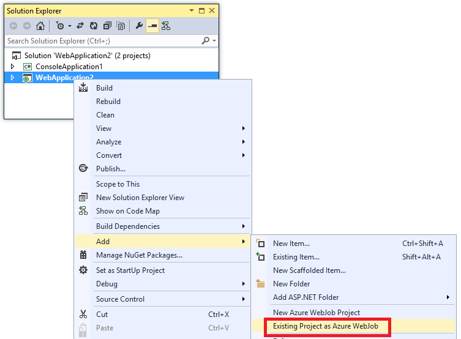
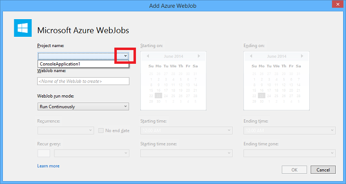

<properties 
	pageTitle="使用 Visual Studio 部署 Web 作业" 
	description="了解如何使用 Visual Studio 将 Azure Web 作业部署到 Azure Web Apps。" 
	services="app-service" 
	documentationCenter="" 
	authors="tdykstra" 
	manager="wpickett" 
	editor="jimbe"/>

<tags
	ms.service="app-service"
	ms.date="04/27/2016"
	wacn.date="06/29/2016"/>

# 使用 Visual Studio 部署 Web 作业

## 概述

本主题说明如何使用 Visual Studio 将控制台应用程序项目作为 [Azure Web 作业](/documentation/articles/websites-webjobs-resources/)部署到 [Azure Web 应用](/documentation/services/web-sites/)中。有关如何使用 [Azure 管理门户](https://manage.windowsazure.cn)部署 Web 作业的信息，请参阅[使用 Web 作业运行后台任务](/documentation/articles/web-sites-create-web-jobs)。

当 Visual Studio 部署启用 Web 作业的控制台应用程序项目时，它会执行两个任务：

* 将运行时文件复制到 Web 应用中的相应文件夹（对于连续 Web 作业，该文件夹为 *App\_Data/jobs/continuous*，对于计划的按需 Web 作业，则为 *App\_Data/jobs/triggered*）。
* 为已计划在特定时间运行的 Web 作业设置 Azure 计划程序作业。（无需为连续 Web 作业执行此操作。）

已启用 Web 作业的项目中添加了以下项：

* [Microsoft.Web.WebJobs.Publish](http://www.nuget.org/packages/Microsoft.Web.WebJobs.Publish/) NuGet 包。
* [webjob-publish-settings.json](#publishsettings) 文件，其中包含部署和计划程序设置。 

可以将这些项添加到现有控制台应用程序项目，或使用模板创建已启用 Web 作业的新控制台应用程序项目。

以 Web 作业的方式部署项目，或者将项目链接到 Web 项目，因此每当你要部署 Web 项目时，项目便会自动部署。为了链接项目，Visual Studio 会在 Web 项目的 [webjobs-list.json](#webjobslist) 文件中包含启用 Web 作业的项目的名称。

 

## 先决条件

安装 Azure .NET SDK 后，便可以在 Visual Studio 2015 中使用 Web 作业部署功能：

* [Azure SDK for .NET (Visual Studio 2015)](http://go.microsoft.com/fwlink/?linkid=518003).

## 为现有的控制台应用程序项目启用 Web 作业部署

可以使用两个选项：

* [使用 Web 项目启用自动部署](#convertlink)。

	配置现有控制台应用程序项目，以便在部署 Web 项目时，它以 Web 作业的方式自动部署。当你要在与运行相关 Web 应用程序相同的 Web 应用中运行 Web 作业时，请使用此选项。

* [不使用 Web 项目启用部署](#convertnolink)。

	配置现有控制台应用程序项目以 Web 作业的方式部署，且不提供 Web 项目的链接。当你要在 Web 应用本身中运行 Web 作业，且 Azure 中没有正在运行的 Web 应用时，请使用此选项。为了能够缩放不受 Web 应用资源影响的 Web 作业资源，你可能想要执行此操作。

### 使用 Web 项目启用自动 Web 作业部署
  
1. 右键单击“解决方案资源管理器”中的 Web 项目，然后单击“添加”>“用作 Azure Web 作业的现有项目”。

	
	
	此时将显示“[添加 Azure Web 作业](#configure)”对话框。

1. 在“项目名称”下拉列表中，选择要添加为 Web 作业的控制台应用程序项目。

	

2. 完成“[添加 Azure Web 作业](#configure)”对话框，然后单击“确定”。

### 不使用 Web 项目启用 Web 作业部署
  
1. 右键单击“解决方案资源管理器”中的控制台应用程序项目，然后单击“发布为 Azure Web 作业”。 

	
	
	此时将显示“[添加 Azure Web 作业](#configure)”对话框，其“项目名称”框中已选中该项目。

2.  完成“[添加 Azure Web 作业](#configure)”对话框，然后单击“确定”。

	此时将显示“发布 Web”向导。如果你不打算立即发布，请关闭向导。输入的设置将会保存，以便在[部署项目](#deploy)时使用。

## 创建已启用 Web 作业的新项目

若要创建已启用 Web 作业的新项目，可以使用控制台应用程序项目模板，并根据[上一部分](#convert)中所述启用 Web 作业部署。或者，你可以使用 Web 作业新建项目模板：

* [为独立的 Web 作业使用 Web 作业新建项目模板](#createnolink)

	创建一个项目，并将它配置为以 Web 作业的方式部署，且不提供 Web 项目的链接。当你要在 Web 应用本身中运行 Web 作业，且 Azure 中没有正在运行的 Web 应用时，请使用此选项。为了能够缩放不受 Web 应用资源影响的 Web 作业资源，你可能想要执行此操作。

* [在链接到 Web 项目的 Web 作业中使用 Web 作业新建项目模板](#createlink)

	创建一个项目，该项目配置为在针对位于相同解决方案中的 Web 项目进行部署时，自动以 Web 作业的方式部署。当你要在与运行相关 Web 应用程序相同的 Web 应用中运行 Web 作业时，请使用此选项。

> [AZURE.NOTE] Web 作业新建项目模板会自动安装 NuGet 包，并在 *Program.cs* 中包含 [WebJobs SDK](/documentation/articles/websites-dotnet-webjobs-sdk-get-started) 的代码。如果你不想使用 WebJobs SDK，或者想要使用计划 Web 作业（而不是连续 Web 作业），请删除或更改 *Program.cs* 中的 `host.RunAndBlock` 语句。

### 为独立的 Web 作业使用 Web 作业新建项目模板
  
1. 单击“文件”>“新建项目”，然后在“新建项目”对话框中，单击“云”>“Azure Web 作业”。

	
	
2. 遵循前面所示的说明，[将控制台应用程序项目设为独立的 Web 作业项目](#convertnolink)。

### 在链接到 Web 项目的 Web 作业中使用 Web 作业新建项目模板

1. 右键单击“解决方案资源管理器”中的 Web 项目，然后单击“添加”>“新建 Azure Web 作业项目”。

	

	此时将显示“[添加 Azure Web 作业](#configure)”对话框。

2. 完成“[添加 Azure Web 作业](#configure)”对话框，然后单击“确定”。

## 添加 Azure Web 作业对话框

“添加 Azure Web 作业”对话框可让你输入 Web 作业的名称和计划设置。

此对话框中的字段对应于 Azure 管理门户中“新建作业”对话框上的字段。有关详细信息，请参阅[使用 Web 作业运行后台任务](/documentation/articles/web-sites-create-web-jobs)。

对于计划的 Web 作业（而不是连续 Web 作业），Visual Studio 将创建 [Azure 计划程序](/home/features/scheduler/)作业集合（如果尚不存在），然后在该集合中创建一个作业：

* 计划程序作业集合命名为 *WebJobs-{regionname}*，其中的 *{regionname}* 表示托管 Web 应用的区域。例如：WebJobs-WestUS。
* 计划程序作业命名为 *{webappname}-{webjobname}*。例如：MyWebApp-MyWebJob。 
 
>[AZURE.NOTE]
>* 如果你配置了“定期作业”，并将周期频率设置为某个分钟数，则 Azure 计划程序服务不是免费的。其他频率（小时、天等）是免费的。
>
* 如果你部署了某个 Web 作业，但后来想要更改该 Web 作业的类型并重新部署，则需要删除 webjobs-publish-settings.json 文件。这样，Visual Studio 就会再次显示发布选项，使你可以更改 Web 作业的类型。
>
* 如果你部署了某个 Web 作业，并随后将运行模式从连续更改为非连续（或相反），则在你重新部署时，Visual Studio 将在 Azure 中创建新的 Web 作业。如果更改了其他计划设置但保持运行模式不变，或在计划模式与按需模式之间切换，则 Visual Studio 会更新现有的作业，而不是创建新的作业。

## webjob-publish-settings.json

当你设置 Web 作业部署的控制台应用程序时，Visual Studio 将会安装 [Microsoft.Web.WebJobs.Publish](http://www.nuget.org/packages/Microsoft.Web.WebJobs.Publish/) NuGet 包，并将计划信息存储在 Web 作业项目的项目 *Properties* 文件夹中的 *webjob-publish-settings.json* 文件内。以下是该文件的示例：

		{
		  "$schema": "http://schemastore.org/schemas/json/webjob-publish-settings.json",
		  "webJobName": "WebJob1",
		  "startTime": "2014-06-23T00:00:00-08:00",
		  "endTime": "2014-06-27T00:00:00-08:00",
		  "jobRecurrenceFrequency": "Minute",
		  "interval": 5,
		  "runMode": "Scheduled"
		}

你可以编辑此文件目录，Visual Studio 将提供 IntelliSense。文件架构存储在 [http://schemastore.org](http://schemastore.org/schemas/json/webjob-publish-settings.json) 中，你可以在那里查看。

>[AZURE.NOTE]
>
* 如果你配置了“定期作业”，并将周期频率设置为某个分钟数，则 Azure 计划程序不是免费的。其他频率（小时数、天数等）是免费的。

## webjobs-list.json

当你将已启用 Web 作业的项目链接到 Web 项目时，Visual Studio 会将 Web 作业项目的名称存储在 Web 项目的 *Properties* 文件夹中的 *webjobs-list.json* 文件内。该列表可能包含多个 Web 作业项目，如以下示例中所示：

		{
		  "$schema": "http://schemastore.org/schemas/json/webjobs-list.json",
		  "WebJobs": [
		    {
		      "filePath": "../ConsoleApplication1/ConsoleApplication1.csproj"
		    },
		    {
		      "filePath": "../WebJob1/WebJob1.csproj"
		    }
		  ]
		}

你可以编辑此文件目录，Visual Studio 将提供 IntelliSense。文件架构存储在 [http://schemastore.org](http://schemastore.org/schemas/json/webjobs-list.json) 中，你可以在那里查看。
  
## 部署 Web 作业项目

已链接到 Web 项目的 Web 作业项目会通过 Web 项目自动部署。有关 Web 项目部署的信息，请参阅[如何部署到 Web 应用](/documentation/articles/web-sites-deploy)。

若要自动部署某个 Web 作业项目，请在“解决方案资源管理器”中右键单击该项目，然后单击“发布为 Azure Web 作业”。

	
对于独立的 Web 作业，将会显示 Web 项目使用的相同“发布 Web”向导，但其中的可更改设置更少。

## 后续步骤

本文介绍了如何使用 Visual Studio 部署 Web 作业。有关如何在 Visual Studio 中使用连续传送过程部署 Azure Web 作业的信息，请参阅 [Azure Web 作业 - 推荐的资源 - 部署](/documentation/articles/websites-webjobs-resources#deploying)。

<!---HONumber=Mooncake_0215_2016-->