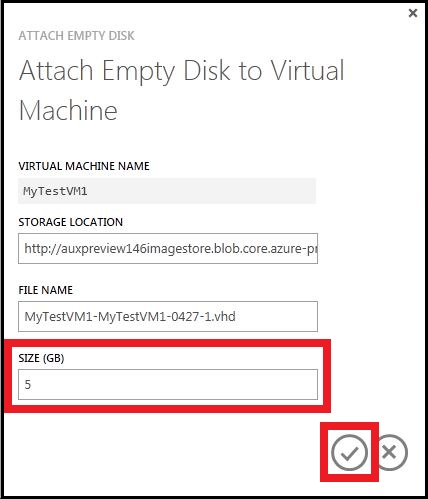

<!---
不要使用此文件。它已被弃用，并且将被删除。请改用 virtual-machines-Linux-tutorial-log-on-attach-disk.md
-->

## 虚拟机创建后如何进行登录 ##

若要管理虚拟机的设置以及在其上运行的应用程序，可以使用 SSH 客户端。为此，您必须在计算机上安装要用于访问虚拟机的 SSH 客户端。您可以选择很多 SSH 客户端程序。以下是可能的选择：

- 如果您要使用运行 Windows 操作系统的计算机，则可能希望使用 PuTTY 等 SSH 客户端。有关详细信息，请参阅 [PuTTY 下载](http://www.chiark.greenend.org.uk/~sgtatham/putty/download.html)。
- 如果您要使用运行 Linux 操作系统的计算机，则可能希望使用 OpenSSH 等 SSH 客户端。有关详细信息，请参阅 [OpenSSH](http://www.openssh.org/)。

此教程将向您演示如何使用 PuTTY 程序访问虚拟机。

1. 请从"管理门户"查找"主机名"和"端口信息"。您可以从虚拟机的仪表板中找到所需信息。单击虚拟机名称并查看仪表板"速览"部分的"SSH 详细信息"。

	

2. 打开 PuTTY 程序。

3. 输入您从仪表板收集到的"主机名"和"端口信息"，然后单击"打开"。

	

4. 使用您在创建虚拟机时指定的 NewUser1 帐户登录到虚拟机。

	

	您现在可以像使用任何其他服务器一样使用该虚拟机。

## 如何将数据磁盘附加到新虚拟机 ##

您的应用程序可能需要存储数据。若要执行此操作，您可以将数据磁盘附加到之前创建的虚拟机。执行此操作的最简单方法是将空数据磁盘附加到计算机。

**注意：数据磁盘与资源磁盘的对比**  
数据磁盘驻留在 Azure 存储空间中并且可以用于持久存储文件和应用程序数据。

每个所创建的虚拟机还附加有一个临时的本地  *Resource Disk*。因为资源磁盘上的数据可能不能在重新引导后持久存在，因此它通常由在虚拟机中运行的应用程序和进程用于数据的短暂和临时存储。它还用来为操作系统存储页面文件或交换文件。

在 Linux 上，资源磁盘通常由 Azure Linux 代理管理并且自动装载到 **/mnt/resource**（或 Ubuntu 映像上的 **/mnt**）。请注意，资源磁盘是  *temporary* 磁盘，并且可能在 VM 取消设置时清空。另一方面，在 Linux 上，数据磁盘由内核命名为 `/dev/sdc`，并且用户将需要对该资源进行分区、格式化和安装。请参阅 [Azure Linux 代理用户指南（Azure Linux 代理用户指南）](/documentation/articles/virtual-machines-linux-agent-user-guide/)。

1. 如果您尚未这么做，请登录到 Azure 管理门户。

2. 单击"虚拟机"，然后选择您之前创建的 **MyTestVM1** 虚拟机。

3. 在命令栏上，单击"附加"，然后单击"附加空磁盘"。
	
	将显示"附加空磁盘"对话框。

	

4. 已经为您定义了"虚拟机名称"、"存储位置"和"文件名"。您只需要输入所需的磁盘大小。在"大小"字段中键入 **5**。

	**注意：**所有的磁盘都是从 Azure 存储中的 VHD 文件创建的。您可以为已添加到该存储的 VHD 文件提供名称，但是磁盘的名称是自动生成的。

5. 单击复选标记以将数据磁盘附加到虚拟机。

6. 您可以通过查看仪表板验证数据磁盘是否已成功附加到虚拟机。单击虚拟机的名称以显示仪表板。

	现在虚拟机的磁盘数是 2 个，您附加的磁盘列在"磁盘"表中。

	

您刚刚添加到虚拟机中的数据磁盘在您添加它后处于脱机和未初始化状态。您必须先登录到虚拟机并初始化磁盘，然后才能使用该磁盘存储数据。

1. 使用在上面的"创建虚拟机后如何登录"中列出的步骤连接到虚拟机。

2. 在 SSH 窗口中，键入以下命令，然后输入帐户密码：

	`sudo grep SCSI /var/log/messages`

	您可以在所示消息中找到最后添加的数据磁盘的标识符。

	

3. 在 SSH 窗口中，键入下面的命令以新建设备，然后输入帐户密码：

	`sudo fdisk /dev/sdc`

	>[WACOM.NOTE] 此示例中，如果 /sbin 或 /usr/sbin 不在您的 `$PATH` 中，您在某些分发上可能需要使用  `sudo -i`。

4. 键入 **n** 以创建新分区。

	

5. 键入 **p** 将该分区设置为主分区，键入 **1** 将其设置为第一分区，然后键入 Enter 以接受柱面的默认值。

	

6. 键入 **p** 以查看有关分区磁盘的详细信息。

	

7. 键入 **w** 以写入磁盘的设置。

	

8. 您必须在新分区上创建文件系统。例如，键入下面的命令以创建文件系统，然后输入帐户密码：

	`sudo mkfs -t ext4 /dev/sdc1`

	

	>[WACOM.NOTE] 注意，在 SUSE Linux Enterprise 11 系统上，对于 ext4 文件系统仅提供了只读访问权限。对于这些系统，建议将新文件系统格式化为 ext3 而非 ext4。

9. 接下来，您必须有一个目录可用于装载新文件系统。例如，键入下面的命令来创建一个用于装载驱动器的新目录，然后输入帐户密码：

	`sudo mkdir /datadrive`

10. 键入下面的命令以安装驱动器：

	`sudo mount /dev/sdc1 /datadrive`

	数据磁盘现在可以作为 **/datadrive** 使用。

11. 将新驱动器添加到 /etc/fstab：

	若要确保在重新引导后自动重新装载驱动器，必须将其添加到 /etc/fstab 文件。此外，强烈建议在 /etc/fstab 中使用 UUID（全局唯一标识符）来引用驱动器而不是只使用设备名称（即 /dev/sdc1）。若要查找新驱动器的 UUID，可以使用 **blkid** 实用程序：
	
		`sudo -i blkid`

	输出与以下内容类似：

		`/dev/sda1: UUID="11111111-1b1b-1c1c-1d1d-1e1e1e1e1e1e" TYPE="ext4"`
		`/dev/sdb1: UUID="22222222-2b2b-2c2c-2d2d-2e2e2e2e2e2e" TYPE="ext4"`
		`/dev/sdc1: UUID="33333333-3b3b-3c3c-3d3d-3e3e3e3e3e3e" TYPE="ext4"`

	>[WACOM.NOTE] blkid 可能不是在所有情况下都需要 sudo 访问权限，不过，如果 /sbin 或 /usr/sbin 不在您的 `$PATH` 中，则在某些分发上使用  `sudo -i` 运行可能更为容易。

	**注意：**错误地编辑 /etc/fstab 文件可能会导致系统无法启动。如果无法确定，请参阅该分发的文档以获取有关如何正确编辑此文件的信息。此外，建议在编辑前先创建 /etc/fstab 文件的备份。

	使用文本编辑器，在 /etc/fstab 文件的末尾输入有关新文件系统的信息。在此示例中，我们将使用在之前的步骤中创建的新 **/dev/sdc1** 设备的 UUID 值并使用装载点 **/datadrive**：

		`UUID=33333333-3b3b-3c3c-3d3d-3e3e3e3e3e3e   /datadrive   ext4   defaults   1   2`

	另外，在基于 SUSE Linux 的系统上，您可能需要使用稍微不同的格式：

		`/dev/disk/by-uuid/33333333-3b3b-3c3c-3d3d-3e3e3e3e3e3e   /   ext3   defaults   1   2`

	如果还创建了其他数据驱动器或分区，您同样也需要分别将其输入到 /etc/fstab 中。

	现在，您可以通过简单地卸载并重新装载文件系统（即使用在之前的步骤中创建的示例装载点 `/datadrive`）来测试文件系统是否已正确装载： 

		`sudo umount /datadrive`
		`sudo mount /datadrive`

	如果第二个命令产生错误，请检查 /etc/fstab 文件的语法是否正确。

	>[WACOM.NOTE] 之后，在不编辑 fstab 的情况下删除数据磁盘可能会导致 VM 无法引导。如果这是一种常见情况，则请注意，大多数分发都提供了  `nofail` 和/或  `nobootwait` fstab 选项，这些选项使系统在磁盘不存在时也能引导。有关这些参数的详细信息，请查阅您的分发文档。

<!--HONumber=41-->
