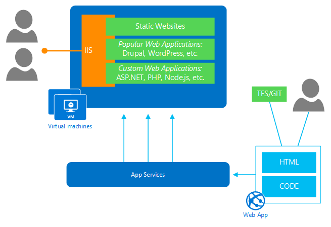

## 我想了解 App Service

Azure 虚拟机可以处理各种云托管任务。但是，创建和管理 VM 基础结构需要有专业技能并付出大量的努力。如果你不需要完全控制运行 Web Apps、移动应用后端、API Apps 等的 VM，则可以使用一个比较简单（且更经济）的解决方案：*平台即服务* (PaaS)。使用 PaaS，Azure 可以处理大多数运行应用程序的 VM 的管理工作。[Azure App Service](/documentation/articles/app-service-value-prop-what-is) 是一种完全托管的 PaaS 产品，可让你在数秒内构建、部署和扩展企业级应用。

对于许多类型的应用程序工作负荷而言，App Service 是最佳选择。企业可能想要构建或迁移可处理每周数以百万次点击的商业网站，该网站部署在全球若干数据中心。同一企业可能还部署了业务线应用用于从企业 Active Directory 跟踪已经过身份验证的用户的费用报告，应用可能包含移动设备组件并连接到本地资源和业务流程。费用报告可能需要使用周期性的后台作业来计算和汇总大量信息。IT 顾问可以采用常用的开放源应用程序为小型企业设置内容管理系统。下图显示了一些可以在 Azure App Service 中运行的 Web 应用类型。

 
 
**图：Azure App Service 支持通过各种技术构建的静态网页、常用 Web 应用程序和自定义 Web 应用程序。你还可以运行移动后端、API 应用和非 Web 计算工作负荷（使用 Web 作业）。**

借助 Azure App Service，你还可以使用 [WebJobs](/documentation/articles/websites-webjobs-resources) 功能运行任何类型的计算工作负荷。

Azure App Service 允许你选择在包含多个用户所创建的多个应用的共享 VM 上运行，或者在仅由你使用的 VM 上运行。VM 是通过 Azure App Service 管理的资源池的一部分，因此允许获得高可靠性和容错能力。

入门都很轻松。借助 Azure App Service，用户可以从一系列应用程序、框架和模板中进行选择并在几秒内创建一个 Web 应用。然后，他们可以使用最喜欢的开发工具（WebMatrix、Visual Studio、任何其他编辑器）和源控件选项来设置持续集成，并作为一个团队进行开发。依赖于 MySQL 数据库的应用程序可以使用 ClearDB（Microsoft 合作伙伴）为 Azure 提供的 MySQL 服务。

开发人员可以使用 Azure App Service 创建可缩放的大型 Web 应用程序。该技术支持使用 ASP.NET、PHP、Node.js 和 Python 创建应用程序。例如，应用程序可以使用易贴的会话，而许多现有 Web 应用可以不做任何更改移动到此云平台。在 Azure App Service 上构建的 Web 应用可随意使用 Azure 的其他方面，例如服务总线、SQL 数据库和 Blob 存储。你还可以在不同 VM 中运行一个应用程序的多个副本，而 Azure App Service 会自动在各 VM 中对请求进行负载平衡。因为新 Web 应用实例是在已存在的 VM 中创建的，因此可以非常快速地启动新的应用程序实例；这明显快于等待创建新的 VM。

如[上图](#appservice_diagram)所示，你可以通过多种方式将代码和其他 Web 内容发布到 Azure App Service 中。你可以使用 FTP、FTPS 或 Microsoft 的 WebDeploy 技术。Azure App Service 还支持从源控件系统发布代码，例如 Git、GitHub、CodePlex、BitBucket、Dropbox、Mercurial、Team Foundation Server 和基于云的 Team Foundation Service。

<!---HONumber=74-->