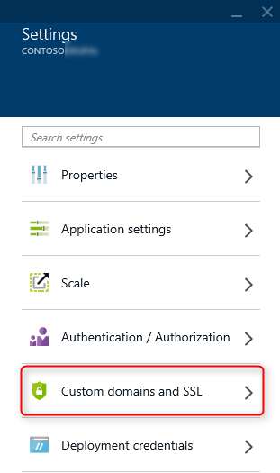
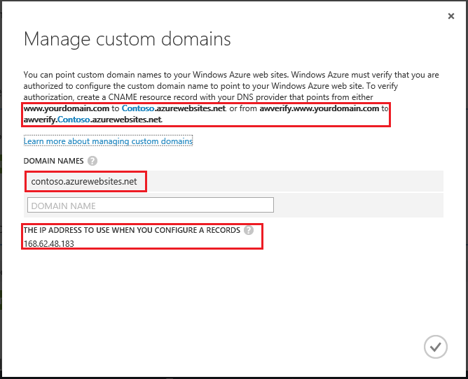

域名系统 (DNS) 用于在 Internet 上查找资源。例如，当您在浏览器中输入一个网站地址或单击 Web 页面上的某个链接时，它使用 DNS 将域转换为 IP 地址。IP 地址有点像街道地址，但其用户友好性并不是很好。例如，记住 **contoso.com** 这样的 DNS 名称比较容易，而记住 192.168.1.88 或 2001:0:4137:1f67:24a2:3888:9cce:fea3 这样的 IP 地址则要困难得多。

DNS 系统基于 *records*。记录将特定的 *name*（例如 **contoso.com**）与一个 IP 地址或其他的 DNS 名称相关联。当某个应用程序（例如 Web 浏览器）在 DNS 中查找某个名称，它将找到该记录，并将它所指向的内容用作地址。如果它所指向的值是 IP 地址，则浏览器将使用该值。如果它指向另一个 DNS 名称，则应用程序必须再次执行解析。最终，所有名称解析都将以 IP 地址的形式结束。

当您创建 Azure 网站时，DNS 名称将自动分配到站点。此名称采用 **&lt;yoursitename&gt;.azurewebsites.net** 的格式。创建 DNS 记录时，还有一个虚拟 IP 地址可供使用，因此您可以创建指向 **.azurewebsites.net** 的记录，或者可以指向该 IP 地址。

> [WACOM.NOTE] 如果您删除或重新创建您的网站，或者在将网站模式已设置为基本、共享或标准后将其更改为免费，则您的网站的 IP 地址将更改。

此外还有多种类型的记录，每种类型都有其自己的功能和限制，但是对于网站我们只关心两种，即  *A* 和  *CNAME* 记录

###地址记录（A 记录）

A 记录将域（例如 **contoso.com** 或 **www.contoso.com**）、 *or a wildcard domain*（例如 \*.contoso.com）映射到 IP 地址。对于 Azure 网站而言，这是服务的虚拟 IP 或者您为网站购买的具体 IP 地址。

A 记录相比于 CNAME 记录的主要优势是：

* 您可以将根域（例如 **contoso.com**）映射到 IP 地址；许多注册机构仅允许使用 A 记录执行此操作。

* 您可以有一个使用通配符的条目（例如 \*.contoso.com），它将处理多个子域（例如 **mail.contoso.com**、**blogs.contoso.com** 或 **www.contoso.com**）的请求。

> [WACOM.NOTE] 由于 A 记录映射到静态 IP 地址，因此它无法自动解析网站的 IP 地址的更改。用于 A 记录的 IP 地址是您为网站配置自定义域名设置时提供的；但是，如果您删除并重新创建了网站或者将网站模式改回了免费，则该值可能会更改。

###别名记录（CNAME 记录）

CNAME 记录将  *specific* DNS 名称（例如 **mail.contoso.com** 或 **www.contoso.com**）映射到另一个（规范）域名。对于 Azure 网站，规范域名是您的网站的 **&lt;yoursitename>.azurewebsites.net** 域名。创建后，CNAME 将为 **&lt;yoursitename>.azurewebsites.net** 域名创建一个别名。CNAME 条目将自动解析为您的 **&lt;yoursitename>.azurewebsites.net** 的 IP 地址，因此，如果网站的 IP 地址发生更改，您不必采取任何操作。

> [WACOM.NOTE] 某些域注册机构只允许您在使用 CNAME 记录（例如 **www.contoso.com**）而不是根名称（例如 **contoso.com**）时映射子域。有关 CNAME 记录的详细信息，请参阅由您的注册机构提供的文档、<a href="http://en.wikipedia.org/wiki/CNAME_record">关于 CNAME 记录的 Wikipedia 条目</a>或 <a href="http://tools.ietf.org/html/rfc1035">IETF 域名 - 实现和规范</a>文档。

###Azure 网站 DNS 细节

为 Azure 网站使用 A 记录需要您首先创建以下 CNAME 记录之一：

* **对于根域或通配符子域** - **awverify** 的 DNS 名称用于 **awverify.&lt;yourwebsitename&gt;.azurewebsites.net**。

* **对于特定子域** - **awverify.&lt;sub-domain>** 的 DNS 名称用于 **awverify.&lt;yourwebsitename&gt;.azurewebsites.net**。例如，如果 A 记录用于 **blogs.contoso.com**，则为 **awverify.blogs**。

此 CNAME 记录用于验证您正在尝试使用的您自己的域。此操作是对创建指向您的网站的虚拟 IP 地址的 A 记录的补充。

您可以按照以下步骤找到您的网站的 IP 地址以及 **awverify** 名称和 **.azurewebsites.net** 名称：

1. 在您的浏览器中，打开 [Azure 管理门户](https://manage.windowsazure.cn)。

2. 在"网站"选项卡中，单击您的网站的名称，选择"仪表板"，然后从页面底部选择"管理域"。

	

	> [WACOM.NOTE] 如果未启用"管理域"，则您正在使用免费的网站。您不能为免费网站使用自定义域名，并且必须升级到共享。基本或标准模式。有关网站模式的详细信息，包括如何更改网站模式，请参阅[如何缩放网站](/documentation/articles/web-sites-scale)。

6. 在"管理自定义域"对话框中，您将看到 **awverify** 信息、当前分配的 **.azurewebsites.net** 域名和虚拟 IP 地址。保存此信息，因为将在创建 DNS 记录时使用它。

	

<!--HONumber=41-->
