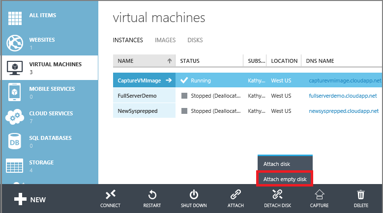
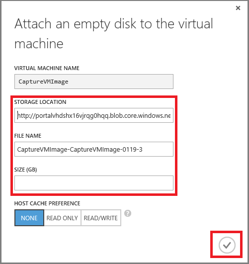

有关磁盘的更多详细信息，请参阅[关于虚拟机的磁盘和 VHD](/documentation/articles/virtual-machines-linux-about-disks-vhds)。

##如何：附加空磁盘

附加空磁盘是添加数据磁盘的更简单方法，因为 Azure 将为你创建 .vhd 文件并将其存储在存储帐户中。

1. 单击“虚拟机”，然后选择相应的虚拟机。

2. 在命令栏上，单击“附加”，然后单击“附加空磁盘”。

	

3.	将显示“附加空磁盘”对话框。

	

	请执行以下操作：

	- 在“文件名”中，接受默认名称或为用于磁盘的 .vhd 文件键入另一个名称。数据磁盘使用自动生成的名称，即使你为 .vhd 文件键入另一个名称。

	- 键入数据磁盘的**大小 (GB)**。

	- 单击复选标记以完成。

4.	创建并附加数据磁盘后，它列出在虚拟机的仪表板中。

	
	
> [AZURE.NOTE]在添加新数据磁盘后，你需要登录到虚拟机并初始化磁盘，然后虚拟机才能使用磁盘来存储数据。

##如何：附加现有磁盘

附加现有磁盘需要存储帐户中具有可用的 .vhd。使用 [Add-AzureVhd](https://msdn.microsoft.com/zh-cn/library/azure/dn495173.aspx) cmdlet 将 .vhd 文件上载到存储帐户。在创建并上载 .vhd 文件后，你可以将其附加到虚拟机。

1. 单击“虚拟机”，然后选择相应的虚拟机。

2. 在命令栏中，单击“附加”，然后选择“附加磁盘”。

	

	将显示“附加磁盘”对话框。

	

3. 选择您要附加到虚拟机的数据磁盘。

4. 单击复选标记以将数据磁盘附加到虚拟机。

5.	附加数据磁盘后，它列出在虚拟机的仪表板中。

	

<!---HONumber=Mooncake_1207_2015-->