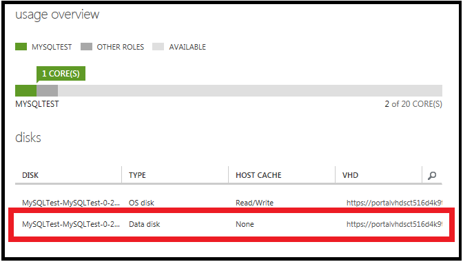

<properties writer="kathydav" editor="tysonn" manager="timlt" />
<tags ms.service=""
    ms.date="12/31/2014"
    wacn.date="04/11/2015"
    />

#如何从虚拟机分离数据磁盘 

- [步骤 1：找到磁盘](#finddisks)
- [步骤 2：分离数据磁盘](#detachdisk)

当您不再需要附加到虚拟机的数据磁盘时，您可以轻松地分离它。这将从虚拟机中删除磁盘，但不会从存储中删除它。若果您希望再次使用磁盘上的现有数据，可以将其重新附加到相同的虚拟机或另一个虚拟机。  

> [WACOM.NOTE] Azure 中的虚拟机使用不同类型的磁盘 - 操作系统磁盘、本地临时磁盘和可选数据磁盘。数据磁盘是为虚拟机存储数据的推荐方法。有关磁盘的详细信息，请参阅[关于磁盘和映像][]。有关说明，请参阅[如何将数据磁盘附加到虚拟机][attachdisk]。

## 步骤 1：找到磁盘##

如果您不知道磁盘名称或要在分离磁盘之前验证磁盘名称，请按照以下步骤进行操作。 

> [WACOM.NOTE] 当您附加磁盘时，Azure 自动将一个名称分配给该磁盘。该名称由云服务名称、虚拟机名称和数字组成。

1. 如果您尚未执行此操作，请登录到 Azure [管理门户](https://manage.windowsazure.cn)。

2. 单击"虚拟机"，然后选择相应的虚拟机。虚拟机的仪表板将打开。

3. 在"磁盘"下，表格将列出所有附加的磁盘的名称和类型。例如，此屏幕显示带有一个操作系统 (OS) 磁盘和一个数据磁盘的虚拟机：
		
		

## 步骤 2：分离磁盘##

找到磁盘的名称后，您就可以分离该磁盘。

1. 单击"虚拟机"，选择具有要分离的数据磁盘的虚拟机。
2. 从命令行中，单击"分离磁盘"。

2. 选择数据磁盘，然后单击复选标记以分离该磁盘。

	

磁盘保留在存储中，但不再附加到虚拟机。

[attachdisk]: /documentation/articles/storage-windows-attach-disk
[关于磁盘和映像]:https://msdn.microsoft.com/zh-cn/library/dd163896
<!--HONumber=41-->
