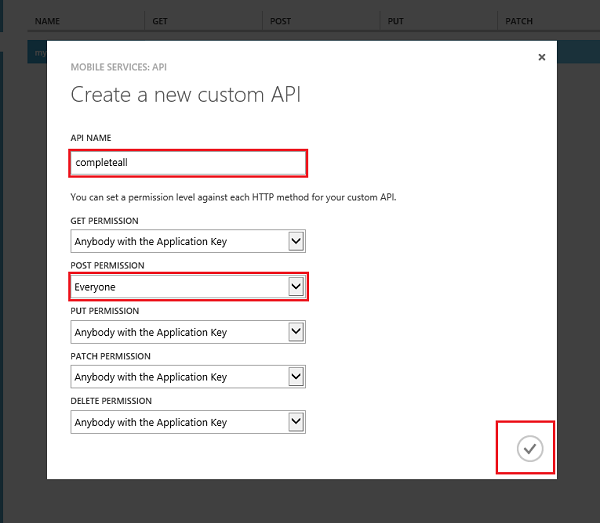
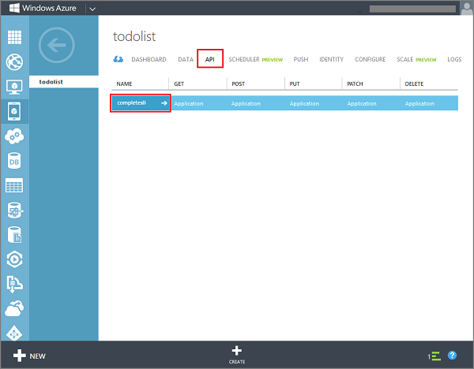

1. 登录到 [Azure 管理门户]、单击"移动服务"，然后单击您的应用。

	

2. 单击"API"选项卡，然后单击"创建自定义 API"。

	

	这将显示"创建新的自定义 API"对话框。

3. 在 **API 名称**中键入_completeall_，然后单击勾选按钮。

	

	这样可以创建新的 API。

	> [WACOM.NOTE] 设置了默认权限，这意味着应用的任何用户都能够调用自定义 API。但是，应用程序密钥无法安全地分发或存储，不能视为安全的凭据。出于这一原因，您应该考虑将访问权限仅限于经过身份验证的用户，仅允许这些用户执行修改数据或影响移动服务的操作。

4. 单击 API 表中新的 **completeall** 条目。

	

5. 单击"脚本"选项卡、将现有代码替换为以下代码，然后单击"保存"：

		exports.post = function(request, response) {
			var mssql = request.service.mssql;
			var sql = "UPDATE todoitem SET complete = 1 " + 
                "WHERE complete = 0; SELECT @@ROWCOUNT as count";
			mssql.query(sql, {
				success: function(results) {			
					if(results.length == 1)							
						response.send(200, results[0]);			
				}
			})
		};

	这段代码使用 [mssql 对象]来直接访问 **todoitem** 表，以在所有项上设置已完成标志。由于使用了 **exports.post** 函数，客户端发送 POST 请求以执行操作。已更改行的数量将以整数值形式返回至客户端。

> [WACOM.NOTE]
> 提供给自定义 API 函数的 <a href="https://msdn.microsoft.com/zh-CN/library/windowsazure/jj554218.aspx" target="_blank">request</a> 和 <a href="https://msdn.microsoft.com/zh-CN/library/windowsazure/dn303373.aspx" target="_blank">response</a> 对象由 <a href="http://go.microsoft.com/fwlink/p/?LinkId=309046" target="_blank">Express.js 库</a>实现。有关详细信息，请参阅<a href="https://msdn.microsoft.com/zh-CN/library/windowsazure/dn280974.aspx" target="_blank">自定义 API</a>。 

接下来，您将修改快速启动应用，以添加新按钮和用于异步调用新的自定义 API 的代码。

<!-- Anchors. -->

<!-- Images. -->

<!-- URLs. -->
[Azure 管理门户]: https://manage.windowsazure.cn/
[mssql 对象]: https://msdn.microsoft.com/zh-CN/library/windowsazure/jj554212.aspx
