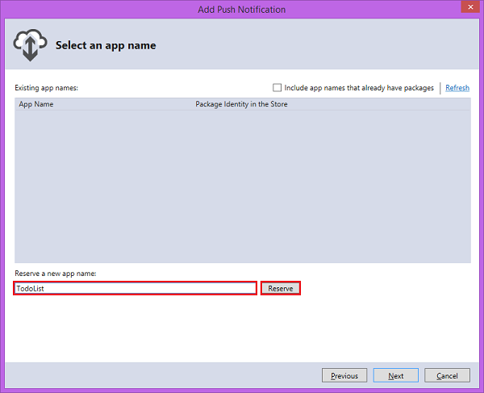
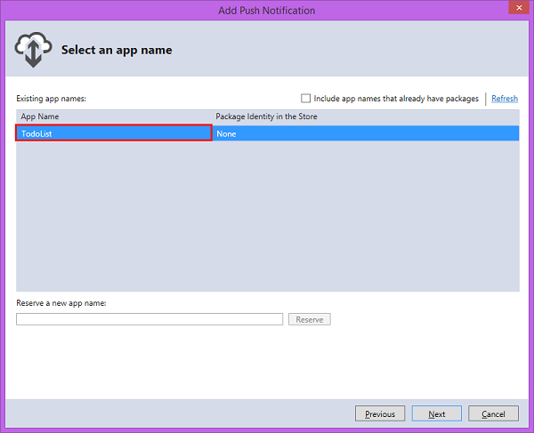

以下步骤将在 Windows 应用商店中注册您的应用、配置您的移动服务以启用推送通知，并将代码添加到您的应用中以在您的通知中心注册设备通道。Visual Studio 2013 通过使用您提供的凭据连接到 Azure 和 Windows 应用商店。 

1. 在 Visual Studio 2013 中，打开"解决方案资源管理器"、右键单击 Windows 应用商店应用项目、单击"添加"，然后单击"推送通知..."。 

	

	这样可以启动"添加推送通知"向导。

2. 单击"下一步"，登录您的 Windows 应用商店帐户，然后在"保留新名称"中提供一个名称，再单击"保留"。

	 

	这样可以创建新的应用注册。

3. 在"应用名称"列表中单击新注册，然后单击"下一步"。

	

4. 在"选择服务"页上，依次单击您的移动服务名称、"下一步"和"完成"。 

	您的移动服务使用的通知中心将随 Windows 通知服务 (WNS) 注册一起更新。现在，您可以通过 Azure 通知中心使用 WNS 将通知从移动服务发送到您的应用。 

	>[WACOM.NOTE]本教程演示了从移动服务后端发送通知的过程。可以使用相同的通知中心从任意后端服务来发送通知。有关更多信息，请参阅[通知中心概述](https://msdn.microsoft.com/zh-CN/library/azure/jj927170.aspx)。

5. 完成该向导后，一个新的"推送设置即将完成"页将在 Visual Studio 中打开。此页详细介绍了用于配置您的移动服务项目以发送通知的另一种方法，该方法不同于本教程中所介绍的方法。 

	>[WACOM.NOTE]通过"添加推送通知"向导添加到您的通用 Windows 应用解决方案的代码是特定于平台的。稍后在此部分中，您将通过共享移动服务客户端代码来删除此冗余，这会使该通用应用更易于维护。  

<!-- URLs. -->
[移动服务入门]: /zh-cn/documentation/articles/mobile-services-javascript-backend-windows-store-dotnet-get-started/
[开始使用数据]: /zh-cn/documentation/articles/mobile-services-windows-store-dotnet-get-started-data/
[在 Visual Studio 2013 中导入发布设置文件]: /zh-cn/documentation/articles/mobile-services-windows-how-to-import-publishsettings/
