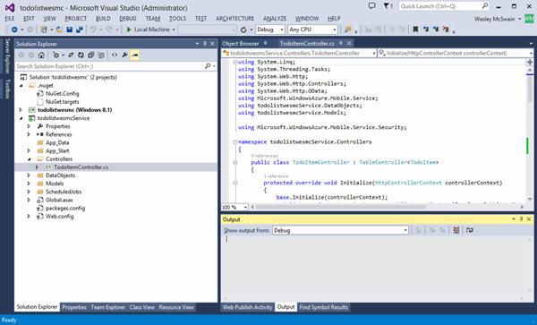
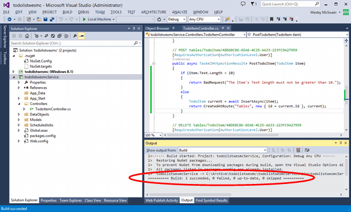
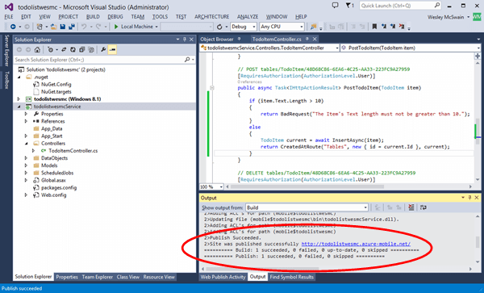

验证用户提交的数据的长度总不失为一种良好做法。在本部分中，您将向移动服务添加代码，用于验证发送至移动服务的字符串数据的长度，并且拒绝过长的字符串，在本例中，它将拒绝长于 10 个字符的字符串。

1. 使用**以管理员身份运行**选项启动 Visual Studio，并打开包含您在[入门]或[数据处理入门](/zh-cn/documentation/articles/mobile-services-dotnet-backend-windows-store-dotnet-get-started-data)  教程中使用的移动服务项目的解决方案。

2. 在 Solution Explorer 窗口中，展开 Todo 列表服务项目并展开**控制器**。打开 TodoItemController.cs 文件，它是移动服务项目的一部分。  

   	

3. 使用以下方法替换  `PostTodoItem` 方法，该方法将确认文本字符串不大于 10 个字符。对于文本长度大于 10 个字符的项，该方法将返回 HTTP 状态码"400 - 错误请求"，其内容包括描述性消息。

        public async Task<IHttpActionResult> PostTodoItem(TodoItem item)
        {
            if (item.Text.Length > 10)
            {
                return BadRequest("The Item's Text length must not be greater than 10.");
            }
            else
            {
                TodoItem current = await InsertAsync(item);
                return CreatedAtRoute("Tables", new { id = current.Id }, current);
            } 
        }

4. 右键单击服务项目并单击"生成"以生成移动服务项目。确认没有出现错误。

   	

5. 右键单击服务项目并单击"发布"。使用您以前在[入门]或[数据处理入门](/zh-cn/documentation/articles/mobile-services-dotnet-backend-windows-store-dotnet-get-started-data)教程中使用的发布设置，将移动服务发布到您的 Windows Azure 帐户。
 
     >[WACOM.NOTE] 或者也可使用在 IIS Express 中本地托管的服务进行测试。有关更多信息，请参阅[数据处理入门](/zh-cn/documentation/articles/mobile-services-dotnet-backend-windows-store-dotnet-get-started-data)教程。

    

<!-- URLs. -->
[入门]: /zh-cn/documentation/articles/mobile-services-dotnet-backend-windows-store-dotnet-get-started/
