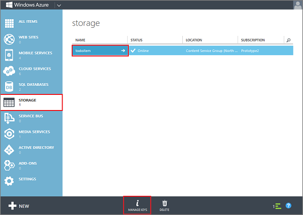
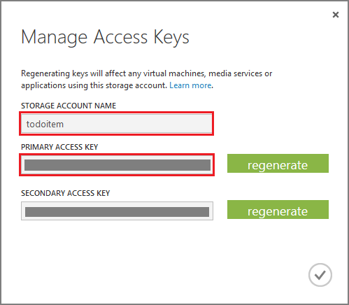
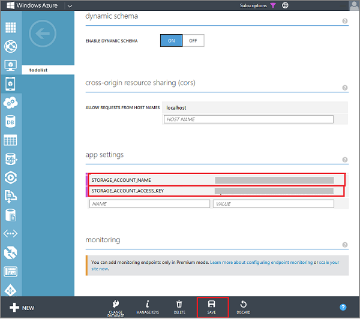

##Install the storage client in the mobile service project

To be able to generate an SAS to upload images to Blob storage, you must first add the NuGet package that installs Storage client library in the mobile service project. 

1. In **Solution Explorer** in Visual Studio, right-click the mobile service project, and then select **Manage NuGet Packages**.

2. In the left pane, select the **Online** category, select **Stabile Only**, search for **WindowsAzure.Storage**, click **Install** on the **Azure Storage** package, then accept the license agreements. 

  	

  	This adds the client library for Azure storage services to the mobile service project.

##Update the TodoItem definition in the data model

The TodoItem class defines the data object, and you need to add the same properties to this class as you did on the client.

1. In Visual Studio 2013, open your mobile service project, expand the DataObjects folder, then open the TodoItem.cs project file.
	
2. Add the following new properties to the **TodoItem** class:

        public string containerName { get; set; }
		public string resourceName { get; set; }
		public string sasQueryString { get; set; }
		public string imageUri { get; set; } 

	These properties are used to generate the SAS and to store image information. Note that the casing on these properties matches the JavaScript backend version. 

	>[WACOM.NOTE] When using the default database initializer, Entity Framework will drop and recreate the database when it detects a data model change in the Code First definition. To make this data model change and maintain existing data in the database, you must use Code First Migrations. The default initializer cannot be used against a SQL数据库 in Azure. For more information, see [How to Use Code First Migrations to Update the Data Model](/zh-cn/documentation/articles/mobile-services-dotnet-backend-how-to-use-code-first-migrations).

##Update the TodoItem controller to generate a shared access signature 

The existing **TodoItemController** is updated so that the **PostTodoItem** method generates an SAS when a new TodoItem is inserted. You also 

0. If you haven't yet created your storage account, see [How To Create a Storage Account].

1. In the Management Portal, click **Storage**, click the storage account, then click **Manage Keys**. 

  	

2. Make a note of the **Storage Account Name** and **Access Key**.

   	

3. In your mobile service, click the **Configure** tab, scroll down to **App settings** and enter a **Name** and **Value** pair for each of the following that you obtained from the storage account, then click **Save**.

	+ `STORAGE_ACCOUNT_NAME`
	+ `STORAGE_ACCOUNT_ACCESS_KEY`

	

	The storage account access key is stored encrypted in app settings. You can access this key from any server script at runtime. For more information, see [App settings].

4. In Solution Explorer in Visual Studio, open the Web.config file for the mobile service project and add the following new app settings, replacing the placeholders with the storage account name and access key that you just set in the portal:

		<add key="STORAGE_ACCOUNT_NAME" value="**your_account_name**" />
		<add key="STORAGE_ACCOUNT_ACCESS_KEY" value="**your_access_token_secret**" />

	The mobile service uses these stored settings when it runs on the local computer, which lets you test the code before you publish it. When running in Azure, the mobile service instead uses app settings values set in the portal and ignores these project settings. 

7.  In the Controllers folder, open the TodoItemController.cs file and add the following **using** directives:

		using System;
		using Microsoft.WindowsAzure.Storage.Auth;
		using Microsoft.WindowsAzure.Storage.Blob;
  
8.  Replace the existing **PostTodoItem** method with the following code:

        public async Task<IHttpActionResult> PostTodoItem(TodoItem item)
        {
            string storageAccountName;
            string storageAccountKey;

            // Try to get the Azure storage account token from app settings.  
            if (!(Services.Settings.TryGetValue("STORAGE_ACCOUNT_NAME", out storageAccountName) |
            Services.Settings.TryGetValue("STORAGE_ACCOUNT_ACCESS_KEY", out storageAccountKey)))
            {
                Services.Log.Error("Could not retrieve storage account settings.");
            }

            // Set the URI for the Blob Storage service.
            Uri blobEndpoint = new Uri(string.Format("https://{0}.blob.core.chinacloudapi.cn", storageAccountName));

            // Create the BLOB service client.
            CloudBlobClient blobClient = new CloudBlobClient(blobEndpoint, 
                new StorageCredentials(storageAccountName, storageAccountKey));

            if (item.containerName != null)
            {
                // Set the BLOB store container name on the item, which must be lowercase.
                item.containerName = item.containerName.ToLower();

                // Create a container, if it doesn't already exist.
                CloudBlobContainer container = blobClient.GetContainerReference(item.containerName);
                await container.CreateIfNotExistsAsync();

                // Create a shared access permission policy. 
                BlobContainerPermissions containerPermissions = new BlobContainerPermissions();

                // Enable anonymous read access to BLOBs.
                containerPermissions.PublicAccess = BlobContainerPublicAccessType.Blob;
                container.SetPermissions(containerPermissions);

                // Define a policy that gives write access to the container for 5 minutes.                                   
                SharedAccessBlobPolicy sasPolicy = new SharedAccessBlobPolicy()
                {
                    SharedAccessStartTime = DateTime.UtcNow,
                    SharedAccessExpiryTime = DateTime.UtcNow.AddMinutes(5),
                    Permissions = SharedAccessBlobPermissions.Write
                };

                // Get the SAS as a string.
                item.sasQueryString = container.GetSharedAccessSignature(sasPolicy); 

                // Set the URL used to store the image.
                item.imageUri = string.Format("{0}{1}/{2}", blobEndpoint.ToString(), 
                    item.containerName, item.resourceName);
            }

            // Complete the insert operation.
            TodoItem current = await InsertAsync(item);
            return CreatedAtRoute("Tables", new { id = current.Id }, current);
        }

   	This POST method now generates a new SAS for the inserted item, which is valid for 5 minutes, and assigns the value of the generated SAS to the `sasQueryString` property of the returned item. The `imageUri` property is also set to the resource path of the new BLOB to enable image display during binding in the client UI.

	>[WACOM.NOTE] This code creates an SAS for an individual BLOB. If you need to upload multiple blobs to a container using the same SAS, you can instead call the <a href="http://go.microsoft.com/fwlink/?LinkId=390455" target="_blank">generateSharedAccessSignature method</a> with an empty blob resource name, like this: 
	<pre><code>blobService.generateSharedAccessSignature(containerName, '', sharedAccessPolicy);</code></pre>

Next, you will update the quickstart app to add image upload functionality by using the SAS generated on insert.
 
<!-- Anchors. -->

<!-- Images. -->
[0]: ./media/mobile-services-configure-blob-storage/mobile-blob-storage-account.png
[1]: ./media/mobile-services-configure-blob-storage/mobile-blob-storage-account-keys.png

[3]: ./media/mobile-services-configure-blob-storage/mobile-portal-data-tables.png
[4]: ./media/mobile-services-configure-blob-storage/mobile-insert-script-blob.png

[10]: ./media/mobile-services-configure-blob-storage/mobile-blob-storage-app-settings.png

<!-- URLs. -->
[How To Create a Storage Account]: /en-us/manage/services/storage/how-to-create-a-storage-account
[App settings]: http://msdn.microsoft.com/zh-cn/library/windowsazure/b6bb7d2d-35ae-47eb-a03f-6ee393e170f7
