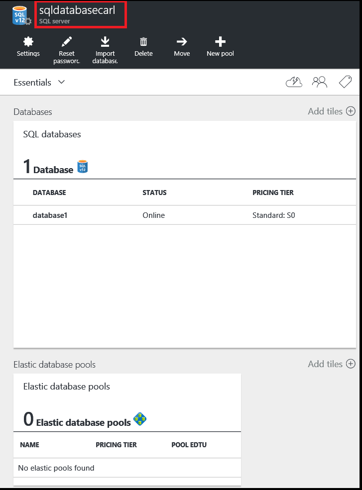
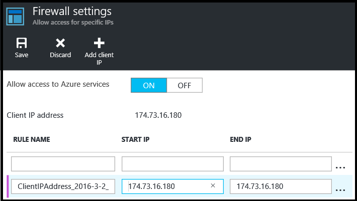
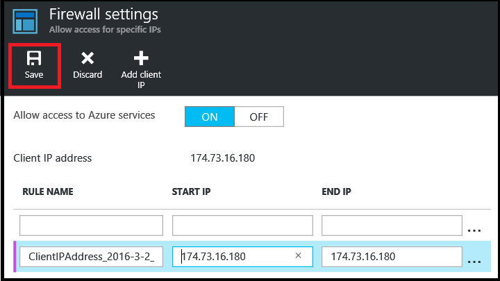

<!--
includes/sql-database-create-new-server-firewall-portal.md

Latest Freshness check:  2016-04-11 , carlrab.

As of circa 2016-04-11, the following topics might include this include:
articles/sql-database/sql-database-get-started-tutorial.md
articles/sql-database/sql-database-configure-firewall-settings

-->
## 创建新的 Aure SQL 服务器级防火墙

在 Azure 门户中使用以下步骤来创建服务器级别防火墙规则，以允许从单个 IP 地址（客户端计算机）或整个 IP 地址范围连接到 SQL 逻辑服务器。

1. 如果当前未连接，请连接到 [Azure 门户](http://portal.azure.cn)。
2. 在“默认”边栏选项卡中，单击“SQL Server”。

  	

2. 在“SQL Server”边栏选项卡中，单击要在其上创建防火墙规则的 SQL 服务器。

 	
           
3. 检查服务器的属性。

 	
      
4. 在“设置”边栏选项卡中，单击“防火墙”。

 	
    
5. 单击“添加客户端 IP”，让 Azure 为客户端 IP 地址创建规则。

      

6. （可选）单击添加的 IP 地址并编辑防火墙地址，以允许从某个 IP 地址范围访问。

      
    
7. 单击“保存”以创建服务器级防火墙规则。

     

	>[AZURE.IMPORTANT] 你的客户端 IP 地址可能会不定时地更改，因此你可能需要创建新的防火墙规则才能访问数据库。你可以使用 [Bing](http://www.bing.com/search?q=my%20ip%20address) 检查自己的 IP 地址，然后添加单个 IP 地址或 IP 地址范围。有关详细信息，请参阅[管理防火墙设置](/documentation/articles/sql-database-configure-firewall-settings/#manage-existing-server-level-firewall-rules-through-the-azure-portal)。

<!---HONumber=Mooncake_0530_2016-->
