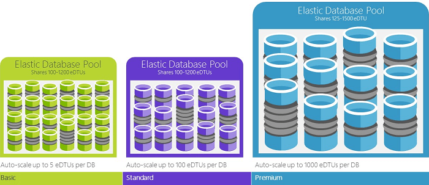

数据库吞吐量单位 (DTU) 是 SQL 数据库中的度量单位，表示在驱动数据库的硬件限制下数据库处理事务的相对能力。DTU 是一个类似汽车马力的概念。它描述了一个数据库与另一个数据库的相对性能。就像汽车马力，数据库的 DTU 越大，它就越强大。马力是许多不同因素的函数：重量、引擎容量、增压、排气系统。同样，DTU 是数据库可以使用的内存数量和类型、计算能力和磁盘的函数。你可以通过阅读[基准概述](/documentation/articles/sql-database-benchmark-overview)详细了解我们是如何确定 DTU 的。

示例：基本的数据库具有 5 DTU，这意味着它的事务吞吐量能力比具有 1750 DTU 的高级 P11 数据库相对小得多。

单个数据库的 DTU 可直接转换为弹性数据库的 eDTU。例如，基本弹性数据库池中的一个数据库最多提供 5 个 eDTU。这与单个基本数据库的性能相同。不同之处在于弹性数据库不会使用池中的任何 eDTU，直到必须这样做。

一个简单的示例可帮助你理解。创建一个具有 1000 个 DTU 的基本弹性数据库池并在其中放置了 800 个数据库。只要在任一时间点只使用 800 个数据库中的 200 个数据库（5 DTU X 200 = 1000），就不会达到池的容量，因此数据库性能不会降低。为清楚起见，此示例进行了简化。涉及的真实数学有些复杂。门户会为你执行数学计算，并会根据历史数据库使用情况提出建议。若要了解建议的工作方式，或者要自己执行数学计算，请参阅[弹性数据库池的价格和性能注意事项](/documentation/articles/sql-database-elastic-pool-guidance)。

<!---HONumber=79-->