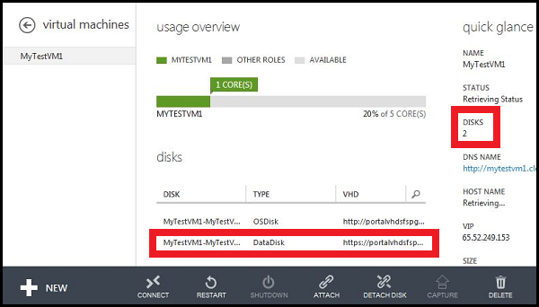
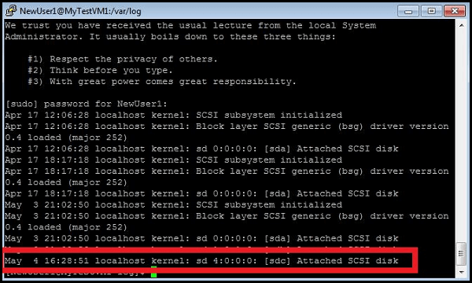
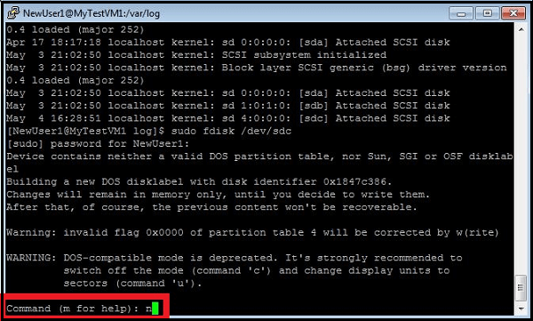
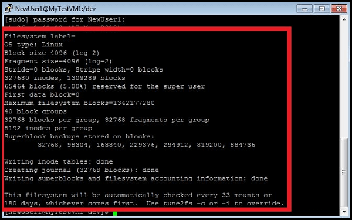

## 如何登录到虚拟机创建表后 ##

若要管理的虚拟机和在计算机运行的应用程序的设置，可以使用 SSH 客户端。为此，您必须在计算机上安装要用于访问虚拟机的 SSH 客户端。你可以选择很多 SSH 客户端程序。以下是可能的选项：

- 如果使用的正在运行 Windows 操作系统的计算机，您可能希望使用 PuTTY 之类的 SSH 客户端。有关详细信息，请参阅[PuTTY 下载](http://www.chiark.greenend.org.uk/~sgtatham/putty/download.html)。
- 如果您使用的运行 Linux 操作系统的计算机，您可能希望使用 OpenSSH 等 SSH 客户端。有关详细信息，请参阅[OpenSSH](http://www.openssh.org)。

此教程将向您演示如何使用 PuTTY 程序访问虚拟机。

1. 查找**主机名**和**端口信息**从管理门户。你可以从虚拟机的仪表板中找到所需信息。单击虚拟机名称，并寻找**SSH 详细信息**中**速览**仪表板的部分。

	

2. 打开 PuTTY 程序。

3. 输入**主机名**和**端口信息**，您从仪表板中，收集然后单击**打开**。

	

4. 登录到虚拟机创建虚拟机时已添加的 NewUser1 帐户。

	

	你现在可以像使用任何其他服务器一样使用该虚拟机。

## 如何将数据磁盘附加到新的虚拟机 ##

您的应用程序可能需要将数据存储。若要执行此操作，您可以将数据磁盘附加到之前创建的虚拟机。若要这样做的最简单方法是将空数据磁盘附加到计算机。

在 Linux 上，通常由 Azure Linux 代理管理并且自动装载到资源磁盘**/mnt/资源**（或**/mnt** Ubuntu 映像上）。另一方面，在 Linux 上的数据磁盘可能名为 /dev/sdc，作为内核，并且用户将需要进行分区、 格式化和装入该资源。请参阅[Azure Linux 代理用户指南](/documentation/articles/virtual-machines-linux-agent-user-guide) 有关详细信息。

>[WACOM.NOTE] 不在资源磁盘上存储数据。此磁盘为应用程序和进程提供临时存储空间，用于存储不需要保存，如交换文件的数据。数据磁盘作为页 blob 中的.vhd 文件驻留 Azure 存储空间，并且提供存储冗余，从而保护您的数据。有关详细信息，请参阅[有关磁盘和映像在 Azure 中的](http://msdn.microsoft.com/zh-cn/library/jj672979.aspx)。

1. 如果尚未这样做，登录到 Azure 管理门户。

2. 单击**虚拟机**，然后选择**MyTestVM1**先前创建的虚拟机。

3. 在命令栏中，单击**附加**，然后单击**附加空磁盘**。
	
	**附加空磁盘**对话框随即出现。

	

4. **虚拟机名称**，**存储位置**，和**文件名**已为您定义。您所要做的就是输入所需的磁盘的大小。类型**5**中**大小**字段。

	**注意：**所有磁盘从 VHD 文件都创建在 Azure 存储中。您可以提供到存储中，添加的 VHD 文件的名称，但自动生成的磁盘的名称。

5. 单击复选标记以将数据磁盘附加到虚拟机。

6. 您可以验证数据磁盘已成功附加到虚拟机通过查看仪表板。单击要显示仪表板的虚拟机的名称。

	磁盘数现在为 2 个虚拟机和中列出了您在附加的磁盘**磁盘**表。

	

您刚刚添加到虚拟机的数据磁盘是脱机和未初始化后将其添加。您必须先登录到虚拟机并初始化磁盘，然后才能使用该磁盘存储数据。

1. 使用在上面列出的步骤连接到虚拟机**如何登录到虚拟机创建表后**。

2. 在 SSH 窗口中，键入以下命令，然后输入帐户密码：

	`sudo grep SCSI /var/log/messages`

	你可以在所示消息中找到最后添加的数据磁盘的标识符。

	

3. 在 SSH 窗口中，键入以下命令以创建新的设备，然后输入帐户密码：

	`sudo fdisk /dev/sdc`

	>[WACOM.NOTE] 在此示例中，您可能需要使用 sudo-i 在某些分发，如果 /sbin 或 /usr/sbin 不在您 $PATH 上。

4. 类型**n**若要创建一个新的分区。

	

5. 类型**p**若要将该分区设置为主分区，键入**1**以使其第一个分区，然后键入 enter 以接受柱面的默认值。

	

6. 键入 **p**以查看有关分区磁盘的详细信息。

	

7. 键入 **w** 以写入磁盘的设置。

	

8. 你必须在新分区上创建文件系统。例如，键入以下命令以创建文件系统中，然后输入帐户密码：

	sudo mkfs -t ext4 /dev/sdc1

	

	>[WACOM.NOTE] 请注意 SUSE Linux Enterprise 11 系统提供对于 ext4 文件系统的只读访问权限。对于这些系统中，我们建议设置新的文件系统格式为 ext3 而非 ext4。

9. 创建一个目录来装入新的文件系统。例如，键入以下命令，然后输入帐户密码：

	`sudo mkdir /datadrive`

10. 键入以下命令以安装驱动器：

	sudo mount /dev/sdc1 /datadrive

	数据磁盘现在就可以用作**/datadrive**。

11. 将新驱动器添加到 /etc/fstab 中：

	若要确保此驱动器处于重新装载自动重新启动后它必须添加到 /etc/fstab 文件。此外，强烈建议的 UUID （通用唯一标识符） 用于在 /etc/fstab 中引用该驱动器，而不只是设备名称 （即 /dev/sdc1)。若要查找的新的驱动器可以使用 UUID **blkid**实用程序：
	
		sudo -i blkid

	输出将类似于以下形式：

		/dev/sda1: UUID="11111111-1b1b-1c1c-1d1d-1e1e1e1e1e1e" TYPE="ext4"
		/dev/sdb1: UUID="22222222-2b2b-2c2c-2d2d-2e2e2e2e2e2e" TYPE="ext4"
		/dev/sdc1: UUID="33333333-3b3b-3c3c-3d3d-3e3e3e3e3e3e" TYPE="ext4"

	>[WACOM.NOTE] blkid 可能不需要在所有情况下的 sudo 访问权限，但是，则可能是更轻松地使用运行 sudo-i 在某些分发，如果 /sbin 或 /usr/sbin 不在您 $PATH 上。

	**注意：**错误地编辑 /etc/fstab 文件可能会导致系统无法启动。如果无法确定，请参阅有关如何正确编辑该文件的信息的分发的文档。此外建议 /etc/fstab 文件的备份在编辑之前创建。

	使用文本编辑器中，输入 /etc/fstab 文件的结尾处的新文件系统有关的信息。在此示例中我们将使用新的 UUID 值**/dev/sdc1**在前面步骤中，并使用装载点中创建的设备**/datadrive**：

		UUID=33333333-3b3b-3c3c-3d3d-3e3e3e3e3e3e   /datadrive   ext4   defaults   1   2

	或者，在基于 SUSE Linux 上的系统上，您可能需要使用稍有不同的格式：

		/dev/disk/by-uuid/33333333-3b3b-3c3c-3d3d-3e3e3e3e3e3e   /   ext3   defaults   1   2

	如果创建其他数据驱动器或分区将需要其输入到单独以及 fstab/等 /。

	現在，您可以測試檔案系統是否適當掛接，方法是取消掛接檔案系統，再重新掛接，例如使用先前步驟中建立的範例掛接點 `/datadrive`在前面的步骤中创建：

		sudo umount /datadrive
		sudo mount /datadrive

	如果第二个命令产生错误，请检查 /etc/fstab 文件的语法正确。

	>[WACOM.NOTE] 随后在不编辑 fstab 的情况下删除数据磁盘可能会导致 VM 无法引导。如果这是一种常见情况，大多数分发都将提供任一 nofail 和/或 nobootwait fstab 选项，将允许系统在启动即使该磁盘不存在。请有关这些参数的详细信息，参阅你的分发的文档。

