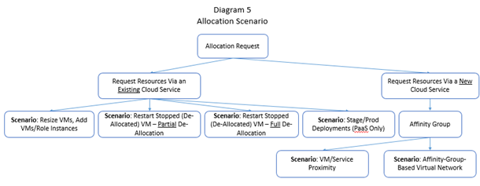

如果本文未解答你的 Azure 问题，请访问 [MSDN 和 CSDN Azure 上的 Azure 论坛](/support/forums/)。你可以在这些论坛上发布你的问题。此外，你可以通过在 [Azure 支持](/support/contact/)站点上选择“获取支持”来发出 Azure 支持请求。

## 常规故障排除步骤
### 对经典部署模型中的常见分配失败进行故障排除

这些步骤可帮助解决虚拟机中的许多分配失败：

- 将 VM 重设为不同的 VM 大小。  
	单击“浏览全部”>“虚拟机(经典)”> 你的虚拟机 >“设置”>“大小”。有关详细步骤，请参阅[调整虚拟机的大小](https://msdn.microsoft.com/zh-cn/library/dn168976.aspx)。

- 从云服务删除所有 VM，然后重新创建 VM。  
	单击“浏览全部”>“虚拟机(经典)”> 你的虚拟机 >“删除”。然后，单击“新建”>“计算”> [虚拟机映像]。

### 对 Azure Resource Manager 部署模型中的常见分配失败进行故障排除

这些步骤可帮助解决虚拟机中的许多分配失败：

- 停止（解除分配）同一可用性集中的所有 VM，然后重新启动每个 VM。  
	若要停止：单击“资源组”> 你的资源组 >“资源”> 你的可用性集 >“虚拟机”> 你的虚拟机 >“停止”。

	所有 VM 都停止后，选中第一个 VM 并单击“启动”。

### 对 Azure Resource Manager 部署模型中的常见分配失败进行故障排除

新门户暂时还没上线，所以你可以通过 Azure PowerShell 或者 Azure CLI 停止，然后启动虚拟机。

## 背景信息
### 分配的工作原理
Azure 数据中心的服务器分区成群集。通常会尝试向多个群集发出分配请求，但分配请求可能带有某些约束，从而强制 Azure 平台只尝试向一个群集发出请求。在本文中，这种情况称为“固定到群集”。 下图 1 演示了在多个群集中尝试进行一般分配的情况。图 2 演示了固定到群集 2（因为现有的云服务 CS\_1 或可用性集托管于此处）的分配情况。

### 发生分配失败的原因
当分配请求固定到某个群集时，由于可用的资源池较小，很可能找不到可用的资源。此外，如果分配请求固定到某个群集，但该群集不支持你所请求的资源类型，那么，即使该群集有可用的资源，你的请求仍会失败。下图 3 说明由于唯一候选群集没有可用的资源，导致已固定的分配失败的情况。图 4 说明由于唯一候选群集不支持所请求的 VM 大小（虽然群集有可用的资源），导致已固定的分配失败的情况。

## 针对经典部署模型中的具体分配失败情况进行故障排除的步骤
以下是造成分配请求被固定的常见分配案例。我们将在本文稍后深入探讨每一个案例。

- 重设 VM 大小或向现有云服务添加 VM 或角色实例
- 重新启动部分停止（已解除分配）的 VM
- 重新启动完全停止（已解除分配）的 VM
- 过渡/生产环境部署（仅适用于平台即服务）
- 地缘组（VM/服务邻近性）
- 基于地缘组的虚拟网络

发生分配错误时，请查看以下是否有任何案例符合你所处的情况。使用 Azure 平台返回的分配错误来识别对应的案例。如果你的请求已固定，请尝试删除一些固定约束，向更多群集展现你的请求，以增加分配成功的机会。

一般而言，只要错误不指示“不支持所请求的 VM 大小”，你永远都可以稍后再试，因为到时群集可能释放足够的资源来满足你的请求。如果问题在于不支持所请求的 VM 大小，请尝试使用不同的 VM 大小。否则，唯一的做法就是删除固定约束。

有两个常见的故障案例与地缘组有关。在过去，地缘组用于支持 VM/服务实例的邻近性，或用于支持创建虚拟网络。在引进区域虚拟网络之后，创建虚拟网络已不再需要地缘组。由于 Azure 基础结构中的网络延迟时间缩短，原本建议使用地缘组来支持 VM/服务邻近性的情况已有所改变。

下图 5 显示（固定的）分配案例的分类。

> [AZURE.NOTE] 每个分配案例中列出的错误均已缩略。有关详细的错误字符串，请参阅 [错误字符串查找](#Error string lookup)。

## 分配案例：重设 VM 大小或向现有云服务添加 VM 或角色实例
**错误**

Upgrade\_VMSizeNotSupported 或 GeneralError

**群集固定的原因**

必须在托管现有云服务的原始群集上，尝试请求重设 VM 大小或向现有云服务添加 VM 或角色实例。创建新的云服务可让 Azure 平台寻找另一个有可用资源的群集，或另一个支持你所请求的 VM 大小的群集。

**解决方法**

如果错误是 Upgrade\_VMSizeNotSupported*，请尝试使用不同的 VM 大小。如果使用不同的 VM 大小不可行，但可接受使用不同的虚拟 IP 地址 (VIP)，则创建新的云服务来托管新的 VM，并将新的云服务添加到运行现有 VM 的区域虚拟网络中。如果现有的云服务未使用区域虚拟网络，你仍然可以为新的云服务创建新的虚拟网络，然后[将现有虚拟网络连接到新的虚拟网络](https://azure.microsoft.com/blog/vnet-to-vnet-connecting-virtual-networks-in-azure-across-different-regions/)。请参阅有关[区域虚拟网络](https://azure.microsoft.com/blog/2014/05/14/regional-virtual-networks/)的详细信息。

如果错误是 GeneralError*，很可能是因为群集虽然支持资源的类型（例如特定的 VM 大小），但群集目前没有可用的资源。类似上述，通过创建新的云服务（请注意，新的云服务必须使用不同的 VIP）尝试添加所需的计算资源，并使用区域虚拟网络连接你的云服务。

## 分配案例：重新启动部分停止（已解除分配）的 VM

**错误**

GeneralError*

**群集固定的原因**

部分解除分配表示你已停止（解除分配）云服务中的一或多个 VM，但不是全部。停止（解除分配）VM 时会释放相关联的资源。因此，重新启动已停止（解除分配）的 VM 是一项新的分配请求。重新启动已部分解除分配的云服务中的 VM 相当于向现有云服务添加 VM。必须在托管现有云服务的原始群集上尝试发出分配请求。创建不同的云服务可让 Azure 平台寻找另一个有可用资源的群集，或另一个支持你所请求的 VM 大小的群集。

**解决方法**

如果可接受使用不同的 VIP，请删除已停止（解除分配）的 VM（但保留相关联的磁盘），并通过不同的云服务加回 VM。使用区域虚拟网络连接你的云服务：
- 如果现有的云服务使用区域虚拟网络，只要将新的云服务添加到相同的虚拟网络即可。
- 如果现有的云服务未使用区域虚拟网络，请为新的云服务创建新的虚拟网络，然后[将现有虚拟网络连接到新的虚拟网络](https://azure.microsoft.com/blog/vnet-to-vnet-connecting-virtual-networks-in-azure-across-different-regions/)。请参阅有关[区域虚拟网络](https://azure.microsoft.com/blog/2014/05/14/regional-virtual-networks/)的详细信息。

## 分配案例：重新启动完全停止（已解除分配）的 VM
**错误**

GeneralError*

**群集固定的原因**

完全解除分配表示已从云服务停止（解除分配）所有 VM。必须在托管云服务的原始群集上尝试发出分配请求来重新启动这些 VM。创建新的云服务可让 Azure 平台寻找另一个有可用资源的群集，或另一个支持你所请求的 VM 大小的群集。

**解决方法**

如果可接受使用不同的 VIP，请删除已停止（解除分配）的原始 VM（但保留相关联的磁盘），并删除对应的云服务（停止（解除分配）VM 时就已释放相关联的计算资源）。创建新的云服务来加回 VM。

## 分配案例：过渡/生产环境部署（仅适用于平台即服务）
**错误**

New\_General* 或 New\_VMSizeNotSupported*

**群集固定的原因**

云服务的过渡环境部署和生产环境部署托管于同一个群集中。添加第二个部署时，将会在托管第一个部署的相同群集中尝试发出对应的分配请求。

**解决方法**

删除第一个部署和原始的云服务，然后重新部署云服务。此操作可能将第一个部署安排到有足够可用资源可满足这两个部署的群集，或安排到支持所请求 VM 大小的群集。

## 分配案例：地缘组（VM/服务邻近性）
**错误**

New\_General* 或 New\_VMSizeNotSupported*

**群集固定的原因**

任何分配给地缘组的计算资源都绑定到一个群集。该地缘组中新的计算资源请求将于托管现有资源的相同群集中尝试发出。无论是通过新的云服务还是现有的云服务创建新资源，都是如此。

**解决方法**

如果不一定需要地缘组，请不要使用地缘组或尝试将计算资源分组为多个地缘组。

## 分配案例：基于地缘组的虚拟网络
**错误**

New\_General* 或 New\_VMSizeNotSupported*

**群集固定的原因**

在引入区域虚拟网络之前，必须先将虚拟网络与地缘组进行关联。这样，便会根据上一部分“分配案例：地缘组：（VM/服务邻近性）”中所述的相同约束，绑定已放入地缘组中的计算资源。计算资源已绑定到一个群集。

**解决方法**

如果不需要地缘组，请为要添加的新资源创建新的区域虚拟网络，然后[将现有虚拟网络连接到新的虚拟网络](https://azure.microsoft.com/blog/vnet-to-vnet-connecting-virtual-networks-in-azure-across-different-regions/)。请参阅有关[区域虚拟网络](https://azure.microsoft.com/blog/2014/05/14/regional-virtual-networks/)的详细信息。

此外，你也可以[将基于地缘组的虚拟网络迁移到区域虚拟网络](https://azure.microsoft.com/blog/2014/11/26/migrating-existing-services-to-regional-scope/)，然后重新添加所需的资源。

## 针对 Azure Resource Manager 部署模型中的具体分配失败情况进行故障排除的步骤
以下是造成分配请求被固定的常见分配案例。我们将在本文稍后深入探讨每一个案例。

- 重设 VM 大小或向现有云服务添加 VM 或角色实例
- 重新启动部分停止（已解除分配）的 VM
- 重新启动完全停止（已解除分配）的 VM

发生分配错误时，请查看以下是否有任何案例符合你所处的情况。使用 Azure 平台返回的分配错误来识别对应的案例。如果你的请求已固定到现有的群集，请删除一些固定约束，向更多群集展现你的请求，以增加分配成功的机会。

一般而言，只要错误不指示“不支持所请求的 VM 大小”，你永远都可以稍后再试，因为到时群集可能释放足够的资源来满足你的请求。如果问题在于不支持所请求的 VM 大小，请参阅下面的解决方法。

## 分配案例：重设 VM 大小或向现有可用性集添加 VM
**错误**

Upgrade\_VMSizeNotSupported* 或 GeneralError*

**群集固定的原因**

必须在托管现有可用性集的原始群集上，尝试请求重设 VM 大小或向现有可用性集添加 VM。创建新的可用性集可让 Azure 平台寻找另一个有可用资源的群集，或另一个支持你所请求的 VM 大小的群集。

**解决方法**

如果错误是 Upgrade\_VMSizeNotSupported*，请尝试使用不同的 VM 大小。如果使用不同的 VM 大小不可行，请停止可用性集中的所有 VM。然后，你可以更改虚拟机的大小，将 VM 分配到支持所需 VM 大小的群集。

如果错误是 GeneralError*，很可能是因为群集虽然支持资源的类型（例如特定的 VM 大小），但群集目前没有可用的资源。如果 VM 可以属于不同的可用性集，请在不同的可用性集（位于相同区域）中创建新的 VM。然后，可以将这个新的 VM 添加到相同的虚拟网络中。

## 分配案例：重新启动部分停止（已解除分配）的 VM
**错误**

GeneralError*

**群集固定的原因**

部分解除分配表示你已停止（解除分配）可用性集中的一或多个（但不是全部）VM。停止（解除分配）VM 时会释放相关联的资源。因此，重新启动已停止（解除分配）的 VM 是一项新的分配请求。重新启动已部分解除分配的可用性集相当于向现有可用性集添加 VM。必须在托管现有可用性集的原始群集上尝试发出分配请求。

**解决方法**

停止可用性集中的所有 VM，再重新启动第一个 VM。这可确保运行新的分配尝试，而且可以选择有可用容量的新群集。

## 分配案例：重新启动完全停止（已解除分配）的 VM
**错误**

GeneralError*

**群集固定的原因**

完全解除分配表示已停止（解除分配）可用性集中的所有 VM。发出分配请求来重新启动这些 VM 时，将会以支持所需大小的所有群集为目标。

**解决方法**

选择要分配的新 VM 大小。如果这不起作用，请稍后重试。

## 错误字符串查找
**New\_VMSizeNotSupported***

“由于部署请求约束，无法预配此部署所需的 VM 大小（或 VM 大小的组合）。可能的话，请尝试放宽约束（例如虚拟网络绑定）、部署到不具有其他部署的托管服务及不同的地缘组（或不具有地缘组的托管服务），或尝试部署到不同的区域。”

**New\_General***

“分配失败；无法满足请求中的约束。请求的新服务部署绑定至地缘组，或以虚拟网络为目标，或此托管服务下已经有部署。上述任一情况都会将新的部署局限于特定的 Azure 资源。请稍后重试，或尝试减少 VM 大小或角色实例数目。或者，可能的话，删除先前提到的约束，或尝试部署到不同的区域。”

**Upgrade\_VMSizeNotSupported***

“无法升级部署。在支持现有部署的资源中，可能没有所请求的 VM 大小 XXX。请稍后再试，尝试使用不同的 VM 大小或较少的角色实例，或在空的托管服务下以创建新的地缘组或没有地缘组绑定来创建部署。”

**GeneralError***

“服务器遇到内部错误。请重试请求。” 或者“无法为服务生成分配。”

<!---HONumber=Mooncake_0523_2016-->