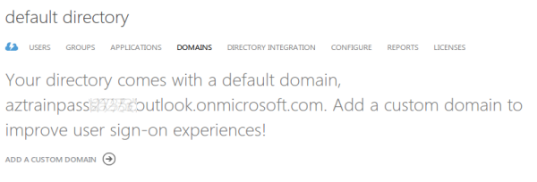
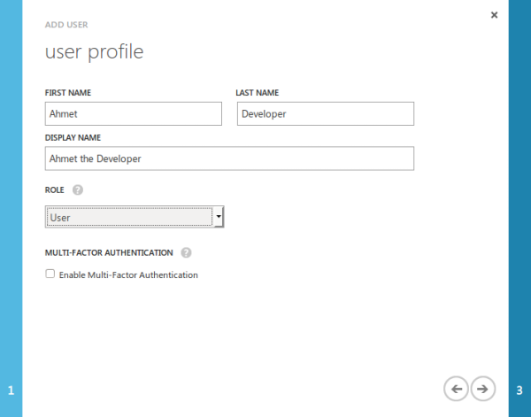
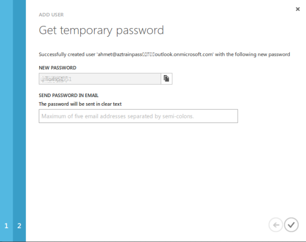
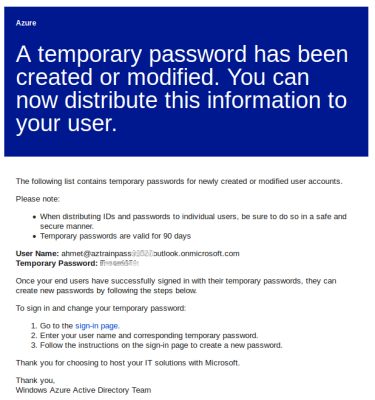
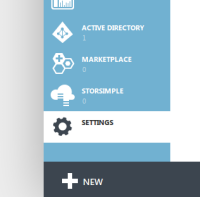
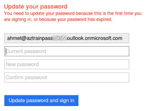

 

> [AZURE.NOTE]如果管理员为你提供了用户名和密码，则你很有可能已经获得了一个工作或学校 ID（有时也称为*组织 ID*）。如果是这样，你可以立即开始使用你的 Azure 帐户来访问需要此类 ID 的 Azure 资源。如果你发现自己无法使用这些资源，可能需要返回到本主题以寻求帮助。有关其他详细信息，请参阅[可用于登录的帐户](/documentation/articles/active-directory-how-subscriptions-associated-directory#BKMK_SignInAccounts)和 [Azure 订阅与 Azure AD 的关联方式](/documentation/articles/active-directory-how-subscriptions-associated-directory#BKMK_SubRelationToDir)。

步骤非常简单。你需要在 Azure 经典门户中找到登录的标识，发现你的默认 Azure Active Directory 域，然后将一个新用户作为 Azure 协同管理员添加到该域。

## 在 Azure 经典门户中找到默认目录

可首先通过用个人 Azure.cn 帐户标识登录到 [Azure 经典门户](https://manage.windowsazure.cn)。登录后，在左侧的蓝色面板中向下滚动，然后单击“ACTIVE DIRECTORY”。

首先，让我们查找有关你在 Azure 中的标识的一些信息。你应会在主窗格中看到类似于下面的内容，其中显示你有一个默认目录。

让我们找出有关该目录的更多信息。单击默认目录行，此时将打开默认目录的属性。

若要查看默认域名，请单击“域”。

在这里你应能看到，在创建 Azure 帐户后，Azure Active Directory 创建了个人默认域，该域是用作 partner.onmschina.cn 子域的个人 ID 的哈希值（从文本字符中生成的数字）。接下来，你将在该域中添加新用户。

## 在默认域中创建新用户

单击“用户”，然后查找你的单个个人帐户。在“源自”列中，你应看到它是一个 **Microsoft 帐户**。我们要在默认的 partner.onmschina.cn Azure Active Directory 域中创建用户。

在接下来的几个步骤中，我们将遵循[这些说明](/documentation/articles/active-directory-create-users/#BKMK_1)，不过会使用具体的示例。

在页面底部，单击“+添加用户”。在显示的页面中，键入新用户名，然后将“用户类型”设为“你的组织中的新用户”。在本示例中，新用户名为 `ahmet`。选择先前发现的默认域作为 `ahmet` 的电子邮件地址的域。完成后，单击下一步箭头。

为 Ahmet 输入更多信息，请确保选择相应的“角色”值。使用“全局管理员”可以轻松地让一切正常运行，但如果你可以使用权限更低的角色，则我们建议你这样做。本示例使用“用户”角色。（在[按角色列出的管理员权限](/documentation/articles/active-directory-assign-admin-roles/#BKMK_1)中了解详细信息。） 除非你要对操作中的每个日志使用多重身份验证，否则不要启用多重身份验证。完成后，单击下一步箭头。

单击“创建”按钮生成并显示 Ahmet 的临时密码。

复制用户姓名电子邮件地址，或使用“在电子邮件中发送密码”。稍后你需要使用相关的信息来登录。

现在，你应会看到来自 Azure Active Directory 的新用户（**Ahmet the Developer**）。你已使用 Azure Active Directory 创建了新的工作或学校标识。但是，此标识目前无权使用 Azure 资源。

如果你使用“在电子邮件中发送密码”，则发送以下类型的电子邮件。

## 为订阅添加 Azure 协同管理员权限

现在，需要将新用户添加为订阅的协同管理员，以便新用户可以登录到经典门户。为此，在左下面板中单击“设置”。

在主设置区域，单击顶部的“管理员”，你应该只会看到自己的个人 Azure.cn 帐户标识。在页面底部，单击“+添加”以指定协同管理员。在这里，输入已创建的新用户的电子邮件地址，包括你的默认域。如下一个屏幕快照所示，默认目录的用户旁边将显示一个绿色的复选标记。请记得选择你希望此用户能够管理的所有订阅。

完成后，应会出现两个用户，包括新的协同管理员标识。从经典门户注销。

## 登录并更改新用户的密码

以创建的新用户身份登录。

系统随即会提示你创建新密码。

如果出现以下消息，则祝贺你操作成功。

## 后续步骤

现在，可以借助新的 Azure Active Directory 标识来使用 Azure 资源组模板

     azure login -e AzureChinaCloud -u <username>
    info:    Executing command login
    warn:    Please note that currently you can login only via Microsoft organizational account or service principal. For instructions on how to set them up, please read http://aka.ms/Dhf67j.
    Password: *********
    /info:    Added subscription Azure Pass
    info:    Setting subscription Azure Pass as default
    +
    info:    login command OK
    ralph@local:~$ azure config mode arm
    info:    New mode is arm
    ralph@local:~$ azure group list
    info:    Executing command group list
    + Listing resource groups
    info:    No matched resource groups were found
    info:    group list command OK
    ralph@local:~$ azure group create newgroup westus
    info:    Executing command group create
    + Getting resource group newgroup
    + Creating resource group newgroup
    info:    Created resource group newgroup
    data:    Id:                  /subscriptions/xxxxxxxx-xxxx-xxxx-xxxx-xxxxxxxxxxxx/resourceGroups/newgroup
    data:    Name:                newgroup
    data:    Location:            chinanorth
    data:    Provisioning State:  Succeeded
    data:    Tags:
    data:
    info:    group create command OK
