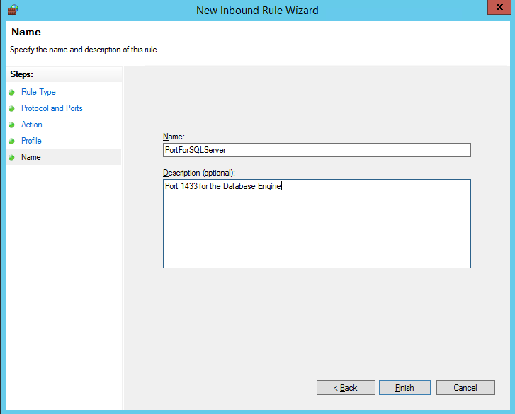
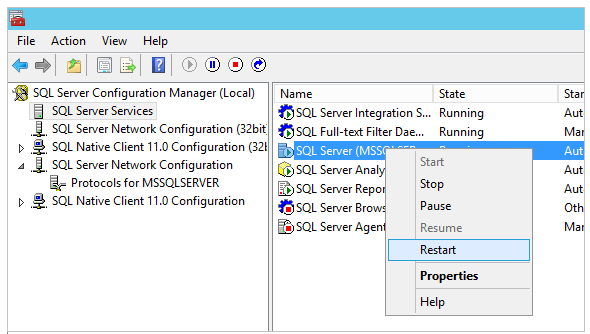
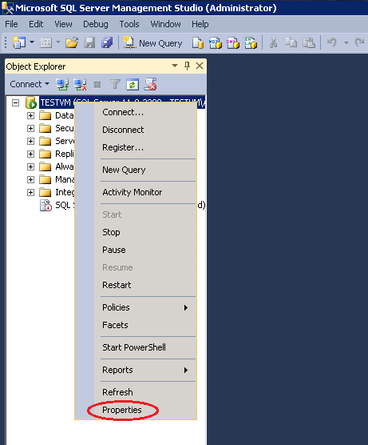
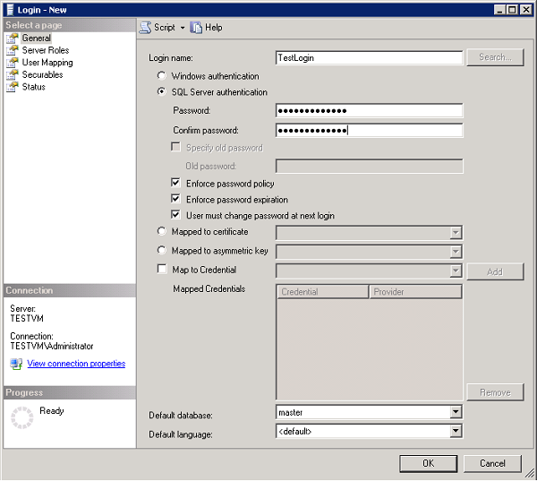
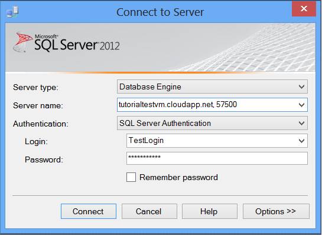

以下步骤演示如何使用 SQL Server Management Studio (SSMS) 通过 Internet 连接到 SQL Server 实例。但是，这些步骤同样适用于使你的 SQL Server 虚拟机可以通过本地和 Azure 中运行的应用程序访问。

你必须先完成下列各部分中描述的下列任务，然后才能从其他 VM 或 Internet 连接到 SQL Server 的实例：

- [为虚拟机创建 TCP 终结点](#create-a-tcp-endpoint-for-the-virtual-machine)
- [在 Windows 防火墙中打开 TCP 端口](#open-tcp-ports-in-the-windows-firewall-for-the-default-instance-of-the-database-engine)
- [将 SQL Server 配置为侦听 TCP 协议](#configure-sql-server-to-listen-on-the-tcp-protocol)
- [配置混合模式的 SQL Server 身份验证](#configure-sql-server-for-mixed-mode-authentication)
- [创建 SQL Server 身份验证登录名](#create-sql-server-authentication-logins)
- [确定虚拟机的 DNS 名称](#determine-the-dns-name-of-the-virtual-machine)
- [从其他计算机连接到数据库引擎](#connect-to-the-database-engine-from-another-computer)

下图中概述了此连接路径：

### 为虚拟机创建 TCP 终结点

要从 Internet 访问 SQL Server，虚拟机必须具有终结点以侦听传入的 TCP 通信。此 Azure 配置步骤将传入 TCP 端口通信定向到虚拟机可以访问的 TCP 端口。

>[AZURE.NOTE]如果你在同一云服务或虚拟网络中连接，则不需要创建一个公开访问的终结点。在这种情况下，你可以继续执行下一步。有关详细信息，请参阅 [Azure 虚拟机中的 SQL Server 的连接注意事项](/documentation/articles/virtual-machines-sql-server-connectivity)。

1. 在 Azure 管理门户上，单击“虚拟机”。
	
2. 单击你新创建的虚拟机。将显示有关你的虚拟机的信息。
	
3. 在靠近页面顶部的位置，选择“终结点”页面，然后在页面底部单击“添加”。
	
4. 在“将终结点添加到虚拟机”页面中，单击“添加独立终结点”，然后单击“下一步”箭头以继续。
	
5. 在“指定终结点的详细信息”页面中，提供以下信息。

	- 在“名称”框中，为终结点提供名称。
	- 在“协议”框中，选择“TCP”。你可以在“公用端口”框中键入“57500”。同样，可在“专用端口”框中键入 SQL Server 的默认侦听端口“1433”。注意，许多组织选择其他端口号以避免恶意的安全攻击。 

6. 单击复选标记以继续。终结点创建完成。

### 在 Windows 防火墙中为数据库引擎的默认实例打开 TCP 端口

1. 通过 Windows 远程桌面连接到虚拟机。登录后，在开始屏幕中，键入“WF.msc”，然后按 ENTER。 

	
2. 在“高级安全 Windows 防火墙”的左窗格中，右键单击“入站规则”，然后在操作窗格中单击“新建规则”。

	

3. 在“新建入站规则向导”对话框中，在“规则类型”下，选择“端口”，然后单击“下一步”。

4. 在“协议和端口”对话框中，使用默认“TCP”。然后，在“特定本地端口”框中，键入数据库引擎实例的端口号（即默认实例对应的端口号“1433”，或你在终结点步骤中为专用端口选择的端口号）。

	

5. 单击**“下一步”**。

6. 在“操作”对话框中，选择“允许连接”，然后单击“下一步”。

	**安全说明：**选择“只允许安全连接”可增加安全性。如果你想在你的环境中配置其他安全性选项，请选择此选项。

	

7. 在“配置文件”对话框中，选择“公用”、“专用”和“域”。然后单击“下一步”。

    **安全说明：**选择“公用”允许通过 Internet 进行访问。只要有可能，就请选择更具限制性的配置文件。

	

8. 在“名称”对话框中，键入此规则的名称和说明，然后单击“完成”。

	

根据需要为其他组件打开附加端口。有关详细信息，请参阅[配置 Windows 防火墙以允许 SQL Server 访问](http://msdn.microsoft.com/zh-cn/library/cc646023.aspx)。

### 将 SQL Server 配置为侦听 TCP 协议

1. 在连接到虚拟机时，在开始页面中，键入“SQL Server 配置管理器”，然后按 ENTER。
	
	

2. 在“SQL Server 配置管理器”的控制台窗格中，展开“SQL Server 网络配置”。

3. 在控制台窗格中，单击“MSSQLSERVER 的协议”（默认实例名称）。 在详细信息窗格中，右键单击“TCP”，默认情况下该协议对于库映像应为“已启用”状态。对于你的自定义映像，单击“启用”（如果其状态为“已禁用”）。

	

5. 在控制台窗格中，单击“SQL Server 服务”。在详细信息窗格中，右键单击“SQL Server (_实例名_)”（默认实例为“SQL Server (MSSQLSERVER)”），然后单击“重新启动”以停止并重新启动该 SQL Server 实例。

	

7. 关闭 SQL Server 配置管理器。

有关启用 SQL Server 数据库引擎的协议的详细信息，请参阅[启用或禁用服务器网络协议](http://msdn.microsoft.com/zh-cn/library/ms191294.aspx)。

### 配置混合模式的 SQL Server 身份验证

在没有域环境的情况下，SQL Server 数据库引擎无法使用 Windows 身份验证。若要从其他计算机连接到数据库引擎，请将 SQL Server 的身份验证模式配置为混合。混合模式身份验证同时允许 SQL Server 身份验证和 Windows 身份验证。

>[AZURE.NOTE]如果你已使用配置的域环境配置了 Azure 虚拟网络，可能没有必要配置混合模式身份验证。

1. 在连接到虚拟机时，在开始页面中，键入“SQL Server 2014 Management Studio”，然后单击勾选图标。

	

	Management Studio 在首次打开时，一定会创建用户 Management Studio 环境。这可能需要一小段时间。

2. Management Studio 会显示“连接到服务器”对话框。在“服务器名称”框中，键入要连接到对象资源管理器中的数据库引擎的虚拟机的名称。（你还可使用“(local)”或一个句点代替虚拟机名称作为“服务器名称”。选择“Windows 身份验证”，在“用户名”框中保留“_your\_VM\_name_\\your\_local\_administrator”。单击“连接”。

	

3. 在 SQL Server Management Studio 的“对象资源管理器”中，右键单击 SQL Server 实例的名称（虚拟机名称），然后单击“属性”。

	

4. 在“安全性”页上的“服务器身份验证”下，选择“SQL Server 和 Windows 身份验证模式”，然后单击“确定”。

	

5. 在 SQL Server Management Studio 对话框中，单击“确定”,以接受重新启动 SQL Server 的要求。

6. 在“对象资源管理器”中，右键单击你的服务器，然后单击“重新启动”。（如果 SQL Server 代理正在运行，它也必须重新启动。）

	

7. 在 SQL Server Management Studio 对话框中，单击“是”以同意重新启动 SQL Server。

### 创建 SQL Server 身份验证登录名

若要从其他计算机连接到数据库引擎，你必须创建至少一个 SQL Server 身份验证登录名。

1. 在 SQL Server Management Studio 对象资源管理器中，展开你要在其中创建新登录名的服务器实例所在的文件夹。

2. 右键单击“安全性”文件夹，指向“新建”，然后选择“登录名…”。

	

3. 在“登录名 - 新建”对话框中的“常规”页上，在“登录名”框中输入新用户的名称。

4. 选择“SQL Server 身份验证”。

5. 在“密码”框中，输入新用户的密码。在“确认密码”框中再次输入该密码。

6. 若要强制实施针对复杂性和强制实施的密码策略选项，请选择“强制实施密码策略”（推荐）。这是选择 SQL Server 身份验证时的默认选项。

7. 若要强制实施针对过期的密码策略选项，请选择“强制密码过期”（推荐）。必须选择强制密码策略才能启用此复选框。这是选择 SQL Server 身份验证时的默认选项。

8. 若要强制用户在首次使用登录名后创建新密码，请选择“用户在下次登录时必须更改密码”（如果此登录名给其他人使用，推荐选择此选项。如果登录名是为了自用，请勿选择此选项。） 必须选择强制密码过期才能启用此复选框。这是选择 SQL Server 身份验证时的默认选项。

9. 从“默认数据库”列表中，为该登录名选择默认数据库。“master”是此选项的默认值。如果你尚未创建用户数据库，则保留此设置为“master”。

10. 在“默认语言”列表中，保留“默认”值。
    
	

11. 如果这是你创建的第一个登录名，可能会需要将此登录名指派为 SQL Server 管理员。这样的话，请在“服务器角色”页面上选中“sysadmin”。

	**安全说明：**Sysadmin 固定服务器角色的成员对数据库引擎具有完全控制权限。应谨慎限制此角色中的成员资格。

	

12. 单击“确定”。

有关 SQL Server 登录名的详细信息，请参阅[创建登录名](http://msdn.microsoft.com/zh-cn/library/aa337562.aspx)。

### 确定虚拟机的 DNS 名称

若要从另一台计算机连接到 SQL Server 数据库引擎，必须知道虚拟机的域名系统 (DNS) 名称。（这是 Internet 用于识别虚拟机的名称）。可以使用 IP 地址，但 IP 地址在 Azure 为冗余或维护而移动资源时可能会变更。DNS 名称将保持不变，因为可将该名称重定向到新的 IP 地址。）

1. 在 Azure 管理门户（或在完成前一步后），选择“虚拟机”。 

2. 在“虚拟机实例”页面上的“速览”列中，找到并复制虚拟机的 DNS 名称。

	
	

### 从其他计算机连接到数据库引擎
 
1. 在连接到 Internet 的计算机上，打开 SQL Server Management Studio。
2. 在“连接到服务器”或“连接到数据库引擎”对话框的“服务器名称”框中，输入虚拟机的 DNS 名称（在以前的任务中确定）和 *DNSName,portnumber* 格式的公共终结点端口号（例如“tutorialtestVM.cloudapp.net,57500”）。若要获取端口号，请登录到 Azure 管理门户并找到虚拟机。在仪表板中，单击“终结点”并使用分配给“MSSQL”的“公用端口”。
3. 在“身份验证”框中，选择“SQL Server 身份验证”。
5. 在“登录名”框中，键入你在前面的任务中创建的登录名。
6. 在“密码”框中，键入你在前面的任务中创建的登录名的密码。
7. 单击“连接”。

	

<!---HONumber=70-->